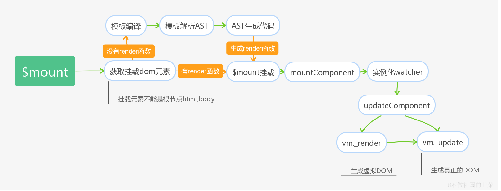
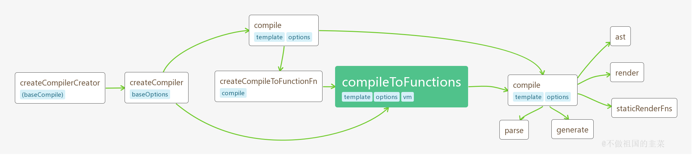

>前面几节我们从```new Vue```创建实例开始，介绍了创建实例时执行初始化流程中的重要两步，配置选项的资源合并,以及响应式系统的核心思想，数据代理。在合并章节，我们对```Vue```丰富的选项合并策略有了基本的认知，在数据代理章节我们又对代理拦截的意义和使用场景有了深入的认识。按照```Vue```源码的设计思路，初始化过程还会进行很多操作，例如组件之间创建关联，初始化事件中心，初始化数据并建立响应式系统等，并最终将模板和数据渲染成为```dom```节点。如果直接按流程的先后顺序分析每个步骤的实现细节，会有很多概念很难理解。因此在这一章节，我们先重点分析一个概念，**实例的挂载渲染流程。**

## 3.1 Runtime Only VS Runtime + Compiler
在正文开始之前，我们先了解一下```vue```基于源码构建的两个版本，一个是```runtime only```(一个只包含运行时的版本)，另一个是```runtime + compiler```(一个同时包含编译器和运行时的版本)。而两个版本的区别仅在于后者包含了一个编译器。

什么是编译器，百度百科这样解释道：

>简单讲，编译器就是将“一种语言（通常为高级语言）”翻译为“另一种语言（通常为低级语言）”的程序。一个现代编译器的主要工作流程：源代码 (source code) → 预处理器 (preprocessor) → 编译器 (compiler) → 目标代码 (object code) → 链接器 (Linker) → 可执行程序 (executables)。

通俗点讲，编译器是一个提供了将**源代码**转化为**目标代码**的工具。从```Vue```的角度出发，内置的编译器实现了将```template```模板转换编译为可执行```javascript```脚本的功能。


### 3.1.1 Runtime + Compiler
一个完整的```Vue```版本是包含编译器的，我们可以使用```template```进行模板编写。编译器会自动将模板字符串编译成渲染函数的代码,源码中就是```render```函数。
如果你需要在客户端编译模板 (比如传入一个字符串给 ```template``` 选项，或挂载到一个元素上并以其 ```DOM``` 内部的 HTML 作为模板)，就需要一个包含编译器的版本。
```js
// 需要编译器的版本
new Vue({
  template: '<div>{{ hi }}</div>'
})
```


### 3.1.2 Runtime Only
只包含运行时的代码拥有创建```Vue```实例、渲染并处理```Virtual DOM```等功能，基本上就是除去编译器外的完整代码。```Runtime Only```的适用场景有两种：
1.我们在选项中通过手写```render```函数去定义渲染过程，这个时候并不需要包含编译器的版本便可完整执行。

```js
// 不需要编译器
new Vue({
  render (h) {
    return h('div', this.hi)
  }
})
```
2.借助```vue-loader```这样的编译工具进行编译，当我们利用```webpack```进行```Vue```的工程化开发时，常常会利用```vue-loader```对```.vue```进行编译，尽管我们也是利用```template```模板标签去书写代码，但是此时的```Vue```已经不需要利用编译器去负责模板的编译工作了，这个过程交给了插件去实现。


很明显，编译过程对性能会造成一定的损耗，并且由于加入了编译的流程代码，```Vue```代码的总体积也更加庞大(运行时版本相比完整版体积要小大约 30%)。因此在实际开发中，我们需要借助像```webpack```的```vue-loader```这类工具进行编译，将```Vue```对模板的编译阶段合并到```webpack```的构建流程中，这样不仅减少了生产环境代码的体积，也大大提高了运行时的性能，一举两得。


## 3.2 实例挂载的基本思路
有了上面的基础，我们回头看初始化```_init```的代码，在代码中我们观察到```initProxy```后有一系列的函数调用，这些函数包括了创建组件关联，初始化事件处理，定义渲染函数，构建数据响应式系统等，最后还有一段代码,在```el```存在的情况下，实例会调用```$mount```进行实例挂载。
```js
Vue.prototype._init = function (options) {
  ···
  // 选项合并
  vm.$options = mergeOptions(
    resolveConstructorOptions(vm.constructor),
    options || {},
    vm
  );
  // 数据代理
  initProxy(vm);
  vm._self = vm;
  initLifecycle(vm);
  // 初始化事件处理
  initEvents(vm);
  // 定义渲染函数
  initRender(vm);
  // 构建响应式系统
  initState(vm);
  // 等等
  ···
  if (vm.$options.el) {
    vm.$mount(vm.$options.el);
  }
}
```
以手写```template```模板为例，理清楚什么是挂载。**我们会在选项中传递```template```为属性的模板字符串，如```<div>{{message}}</div>```，最终这个模板字符串通过中间过程将其转成真实的```DOM```节点，并挂载到选项中```el```代表的根节点上完成视图渲染。这个中间过程就是接下来要分析的挂载流程。**


`Vue`挂载的流程是比较复杂的，接下来我将通过**流程图，代码分析**两种方式为大家展示挂载的真实过程。

### 3.2.1 流程图


如果用一句话概括挂载的过程，可以描述为**确认挂载节点,编译模板为```render```函数，渲染函数转换```Virtual DOM```,创建真实节点。**

### 3.2.2 代码分析
接下来我们从代码的角度去剖析挂载的流程。挂载的代码较多，下面只提取骨架相关的部分代码。

```js
// 内部真正实现挂载的方法
Vue.prototype.$mount = function (el, hydrating) {
  el = el && inBrowser ? query(el) : undefined;
  // 调用mountComponent方法挂载
  return mountComponent(this, el, hydrating)
};
// 缓存了原型上的 $mount 方法
var mount = Vue.prototype.$mount;

// 重新定义$mount,为包含编译器和不包含编译器的版本提供不同封装，最终调用的是缓存原型上的$mount方法
Vue.prototype.$mount = function (el, hydrating) {
  // 获取挂载元素
  el = el && query(el);
  // 挂载元素不能为跟节点
  if (el === document.body || el === document.documentElement) {
    warn(
      "Do not mount Vue to <html> or <body> - mount to normal elements instead."
    );
    return this
  }
  var options = this.$options;
  // 需要编译 or 不需要编译
  // render选项不存在，代表是template模板的形式，此时需要进行模板的编译过程
  if (!options.render) {
    ···
    // 使用内部编译器编译模板
  }
  // 无论是template模板还是手写render函数最终调用缓存的$mount方法
  return mount.call(this, el, hydrating)
}
// mountComponent方法思路
function mountComponent(vm, el, hydrating) {
  // 定义updateComponent方法，在watch回调时调用。
  updateComponent = function () {
    // render函数渲染成虚拟DOM， 虚拟DOM渲染成真实的DOM
    vm._update(vm._render(), hydrating);
  };
  // 实例化渲染watcher
  new Watcher(vm, updateComponent, noop, {})
}

```

我们用语言描述挂载流程的基本思路。

- 确定挂载的```DOM```元素,这个```DOM```需要保证不能为```html，body```这类跟节点。
- 我们知道渲染有两种方式，一种是通过```template```模板字符串，另一种是手写```render```函数，前面提到```template```模板需要运行时进行编译，而后一个可以直接用```render```选项作为渲染函数。因此挂载阶段会有两条分支，```template```模板会先经过模板的解析，最终编译成```render```渲染函数参与实例挂载，而手写```render```函数可以绕过编译阶段，直接调用挂载的```$mount```方法。
- 针对```template```而言，它会利用```Vue```内部的编译器进行模板的编译，字符串模板会转换为抽象的语法树，即```AST```树，并最终转化为一个类似```function(){with(){}}```的渲染函数，这是我们后面讨论的重点。
- 无论是```template```模板还是手写```render```函数，最终都将进入```mountComponent```过程,这个阶段会实例化一个渲染```watcher```,具体```watcher```的内容，另外放章节讨论。我们先知道一个结论，渲染```watcher```的回调函数有两个执行时机，一个是在初始化时执行，另一个是当```vm```实例检测到数据发生变化时会再次执行回调函数。
- 回调函数是执行```updateComponent```的过程，这个方法有两个阶段，一个是```vm._render```,另一个是```vm._update```。 ```vm._render```会执行前面生成的```render```渲染函数，并生成一个```Virtual Dom tree```,而```vm._update```会将这个```Virtual Dom tree```转化为真实的```DOM```节点。


## 3.3 模板编译
通过文章前半段的学习，我们对```Vue```的挂载流程有了一个初略的认识。这里有两个大的流程需要我们详细去理解，一个是```template```模板的编译，另一个是```updateComponent```的实现细节。```updateComponent```的过程，我们放到下一章节重点分析，而这一节剩余的内容我们将会围绕模板编译的设计思路展开。

(编译器的实现细节是异常复杂的，要在短篇幅内将整个编译的过程掌握是不切实际的，并且从大方向上也不需要完全理清编译的流程。因此针对模板，文章分析只是浅尝即止，更多的细节读者可以自行分析)


## 3.3.1 template的三种写法
`template`模板的编写有三种方式，分别是：

- 字符串模板

```js
var vm = new Vue({
  el: '#app',
  template: '<div>模板字符串</div>'
})
```
-  选择符匹配元素的 ```innerHTML```模板

```js
<div id="app">
  <div>test1</div>
  <script type="x-template" id="test">
    <p>test</p>
  </script>
</div>
var vm = new Vue({
  el: '#app',
  template: '#test'
})
```

- `dom`元素匹配元素的```innerHTML```模板

```js
<div id="app">
  <div>test1</div>
  <span id="test"><div class="test2">test2</div></span>
</div>
var vm = new Vue({
  el: '#app',
  template: document.querySelector('#test')
})

```
模板编译的前提需要对```template```模板字符串的合法性进行检测，三种写法对应代码的三个不同分支。
```js
Vue.prototype.$mount = function () {
  ···
  if(!options.render) {
    var template = options.template;
    if (template) {
      // 针对字符串模板和选择符匹配模板
      if (typeof template === 'string') {
        // 选择符匹配模板，以'#'为前缀的选择器
        if (template.charAt(0) === '#') {
          // 获取匹配元素的innerHTML
          template = idToTemplate(template);
          /* istanbul ignore if */
          if (!template) {
            warn(
              ("Template element not found or is empty: " + (options.template)),
              this
            );
          }
        }
      // 针对dom元素匹配
      } else if (template.nodeType) {
        // 获取匹配元素的innerHTML
        template = template.innerHTML;
      } else {
        // 其他类型则判定为非法传入
        {
          warn('invalid template option:' + template, this);
        }
        return this
      }
    } else if (el) {
      // 如果没有传入template模板，则默认以el元素所属的根节点作为基础模板
      template = getOuterHTML(el);
    }
  }
}

// 判断el元素是否存在
function query (el) {
    if (typeof el === 'string') {
      var selected = document.querySelector(el);
      if (!selected) {
        warn(
          'Cannot find element: ' + el
        );
        return document.createElement('div')
      }
      return selected
    } else {
      return el
    }
  }
var idToTemplate = cached(function (id) {
  var el = query(id);
  return el && el.innerHTML
});
```
**注意：其中X-Template模板的方式一般用于模板特别大的 demo 或极小型的应用，官方不建议在其他情形下使用，因为这会将模板和组件的其它定义分离开。**


## 3.3.2 编译流程图解
`vue`源码中编译的设计思路是比较绕，涉及的函数处理逻辑比较多，实现流程中巧妙的运用了偏函数的技巧将配置项处理和编译核心逻辑抽取出来，为了理解这个设计思路，我画了一个逻辑图帮助理解。




## 3.3.3 逻辑解析
即便有流程图，编译逻辑理解起来依然比较晦涩，接下来，结合代码分析每个环节的执行过程。
```js
Vue.prototype.$mount = function () {
  ···
  if(!options.render) {
    var template = options.template;
    if (template) {
      var ref = compileToFunctions(template, {
          outputSourceRange: "development" !== 'production',
          shouldDecodeNewlines: shouldDecodeNewlines,
          shouldDecodeNewlinesForHref: shouldDecodeNewlinesForHref,
          delimiters: options.delimiters,
          comments: options.comments
        }, this);
        var render = ref.render;
    }
    ...
  }
}
```
`compileToFunctions`有三个参数，一个是```template```模板，另一个是编译的配置信息，并且这个方法是对外暴露的编译方法，用户可以自定义配置信息进行模板的编译。最后一个参数是```Vue```实例。

```js
// 将compileToFunction方法暴露给Vue作为静态方法存在
Vue.compile = compileToFunctions;
```

在```Vue```的官方文档中，```Vue.compile```只允许传递一个```template```模板参数，这是否意味着用户无法决定某些编译的行为？显然不是的，我们看回代码，有两个选项配置可以提供给用户，用户只需要在实例化```Vue```时传递选项改变配置，他们分别是：

1.`delimiters`： 该选项可以改变纯文本插入分隔符，当不传递值时，```Vue```默认的分隔符为 ```{{}}```。如果我们想使用其他模板，可以通过```delimiters```修改。

2.`comments` ： 当设为 ```true``` 时，将会保留且渲染模板中的 ```HTML```注释。默认行为是舍弃它们。

**注意，由于这两个选项是在完整版的编译流程读取的配置，所以在运行时版本配置这两个选项是无效的**

接着我们一步步寻找```compileToFunctions```的根源。

首先我们需要有一个认知，**不同平台对```Vue```的编译过程是不一样的，也就是说基础的编译方法会随着平台的不同有区别，编译阶段的配置选项也因为平台的不同呈现差异。但是设计者又不希望在相同平台下编译不同模板时，每次都要传入相同的配置选项。这才有了源码中较为复杂的编译实现。**

```js
var createCompiler = createCompilerCreator(function baseCompile (template,options) {
  //把模板解析成抽象的语法树
  var ast = parse(template.trim(), options);
  // 配置中有代码优化选项则会对Ast语法树进行优化
  if (options.optimize !== false) {
    optimize(ast, options);
  }
  var code = generate(ast, options);
  return {
    ast: ast,
    render: code.render,
    staticRenderFns: code.staticRenderFns
  }
});

var ref$1 = createCompiler(baseOptions);
var compile = ref$1.compile;
var compileToFunctions = ref$1.compileToFunctions;
```
这部分代码是在```Vue```引入阶段定义的，```createCompilerCreator```在传递了一个```baseCompile```函数作为参数后，返回了一个编译器的生成器，也就是```createCompiler```,有了这个生成器，当将编译配置选项```baseOptions```传入后,这个编译器生成器便**生成了一个指定环境指定配置下的编译器**，而其中编译执行函数就是返回对象的```compileToFunctions```。

这里的```baseCompile```是真正执行编译功能的地方，也就是前面说到的特定平台的编译方法。它在源码初始化时就已经作为参数的形式保存在内存变量中。我们先看看```baseCompile```的大致流程。

`baseCompile`函数的参数有两个，一个是后续传入的```template```模板,另一个是编译需要的配置参数。函数实现的功能如下几个：
- 1.把模板解析成抽象的语法树，简称```AST```，代码中对应```parse```部分。
- 2.可选：优化```AST```语法树，执行```optimize```方法。
- 3.根据不同平台将```AST```语法树转换成渲染函数，对应的```generate```函数


接下来具体看看```createCompilerCreator```的实现：
```js
function createCompilerCreator (baseCompile) {
    return function createCompiler (baseOptions) {
      // 内部定义compile方法
      function compile (template, options) {
        ···
      }
      return {
        compile: compile,
        compileToFunctions: createCompileToFunctionFn(compile)
      }
    }
  } 
```
`createCompilerCreator`函数只有一个作用，利用**偏函数**的思想将```baseCompile```这一基础的编译方法缓存，并返回一个编程器生成器，当执行```var ref$1 = createCompiler(baseOptions);```时，```createCompiler```会将内部定义的```compile```和```compileToFunctions```返回。

我们继续关注```compileToFunctions```的由来，它是```createCompileToFunctionFn```函数以```compile```为参数返回的方法，接着看```createCompileToFunctionFn```的实现逻辑。


```js
 function createCompileToFunctionFn (compile) {
    var cache = Object.create(null);

    return function compileToFunctions (template,options,vm) {
      options = extend({}, options);
      ···
      // 缓存的作用：避免重复编译同个模板造成性能的浪费
      if (cache[key]) {
        return cache[key]
      }
      // 执行编译方法
      var compiled = compile(template, options);
      ···
      // turn code into functions
      var res = {};
      var fnGenErrors = [];
      // 编译出的函数体字符串作为参数传递给createFunction,返回最终的render函数
      res.render = createFunction(compiled.render, fnGenErrors);
      res.staticRenderFns = compiled.staticRenderFns.map(function (code) {
        return createFunction(code, fnGenErrors)
      });
      ···
      return (cache[key] = res)
    }
  }
```

`createCompileToFunctionFn`利用了闭包的概念，将编译过的模板进行缓存,```cache```会将之前编译过的结果保留下来，利用缓存可以避免重复编译引起的浪费性能。```createCompileToFunctionFn```最终会将```compileToFunctions```方法返回。

接下来，我们分析一下```compileToFunctions```的实现逻辑。在判断不使用缓存的编译结果后，```compileToFunctions```会执行```compile```方法，这个方法是前面分析```createCompiler```时，返回的内部```compile```方法，所以我们需要先看看```compile```的实现。

```js
function createCompiler (baseOptions) {
  function compile (template, options) {
        var finalOptions = Object.create(baseOptions);
        var errors = [];
        var tips = [];
        var warn = function (msg, range, tip) {
          (tip ? tips : errors).push(msg);
        };
        // 选项合并
        if (options) {
          ···
          // 这里会将用户传递的配置和系统自带编译配置进行合并
        }

        finalOptions.warn = warn;
        // 将剔除空格后的模板以及合并选项后的配置作为参数传递给baseCompile方法
        var compiled = baseCompile(template.trim(), finalOptions);
        {
          detectErrors(compiled.ast, warn);
        }
        compiled.errors = errors;
        compiled.tips = tips;
        return compiled
      }
      return {
        compile: compile,
        compileToFunctions: createCompileToFunctionFn(compile)
      }
}
```
我们看到```compile```真正执行的方法，是一开始在创建编译器生成器时，传入的基础编译方法```baseCompile```，```baseCompile```真正执行的时候，会将用户传递的编译配置和系统自带的编译配置选项合并，这也是开头提到编译器设计思想的精髓。

执行完```compile```会返回一个对象,```ast```顾名思义是模板解析成的抽象语法树，```render```是最终生成的```with```语句,```staticRenderFns```是以数组形式存在的静态```render```。
```js
{
  ast: ast,
  render: code.render,
  staticRenderFns: code.staticRenderFns
}
```

而```createCompileToFunctionFn```最终会返回另外两个包装过的属性```render, staticRenderFns```，他们的核心是**将 ```with```语句封装成执行函数。**

```js
// 编译出的函数体字符串作为参数传递给createFunction,返回最终的render函数
  res.render = createFunction(compiled.render, fnGenErrors);
  res.staticRenderFns = compiled.staticRenderFns.map(function (code) {
    return createFunction(code, fnGenErrors)
  });

  function createFunction (code, errors) {
    try {
      return new Function(code)
    } catch (err) {
      errors.push({ err: err, code: code });
      return noop
    }
  }
```


至此，```Vue```中关于编译器的设计思路也基本梳理清楚了，一开始看代码的时候，总觉得编译逻辑的设计特别的绕，分析完代码后发现，这正是作者思路巧妙的地方。```Vue```在不同平台上有不同的编译过程，而每个编译过程的```baseOptions```选项会有所不同，同时也提供了一些选项供用户去配置，整个设计思想深刻的应用了偏函数的设计思想，而偏函数又是闭包的应用。作者利用偏函数将不同平台的编译方式进行缓存，同时剥离出编译相关的选项合并，这些方式都是值得我们日常学习的。

编译的核心是```parse,generate```过程，这两个过程笔者并没有分析，原因是抽象语法树的解析分支较多，需要结合实际的代码场景才更好理解。这两部分的代码会在后面介绍到具体逻辑功能章节时再次提及。


## 3.4 小结
这一节的内容有两大块，首先详细的介绍了实例在挂载阶段的完整流程，当我们传入选项进行实例化时，最终的目的是将选项渲染成页面真实的可视节点。这个选项有两种形式，一个是以```template```模板字符串传入，另一个是手写```render```函数形式传入，不论哪种，最终会以```render```函数的形式参与挂载，```render```是一个用函数封装好的```with```语句。渲染真实节点前需要将```render```函数解析成虚拟```DOM```,虚拟```DOM```是```js```和真实```DOM```之间的桥梁。最终的```_update```过程让将虚拟```DOM```渲染成真实节点。第二个大块主要介绍了作者在编译器设计时巧妙的实现思路。过程大量运用了偏函数的概念，将编译过程进行缓存并且将选项合并从编译过程中剥离。这些设计理念、思想都是值得我们开发者学习和借鉴的。