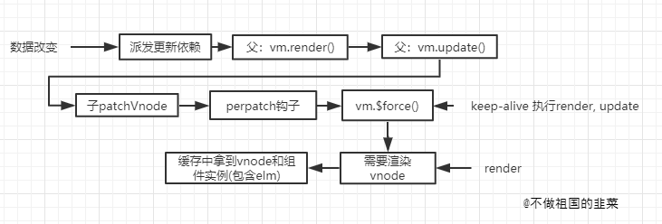
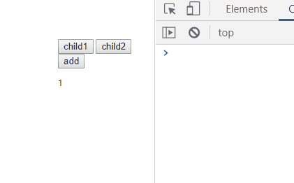

> 上一节，我们对```keep-alive```组件的初始渲染流程以及组件的配置信息进行了源码分析。初始渲染流程最关键的一步是对渲染的组件```Vnode```进行缓存，其中也包括了组件的真实节点存储。有了第一次的缓存，当再次渲染组件时，```keep-alive```又拥有哪些魔法呢？接下来我们将彻底揭开这一层面纱。

## 13.5 准备工作
上一节对```keep-alive```组件的分析，是从我画的一个流程图开始的。如果不想回过头看上一节的内容，可以参考以下的简单总结。
1. `keep-alive`是源码内部定义的组件选项配置，它会先注册为全局组件供开发者全局使用，其中```render```函数定义了它的渲染过程
2. 和普通组件一致，当父在创建真实节点的过程中，遇到```keep-alive```的组件会进行组件的初始化和实例化。
3. 实例化会执行挂载```$mount```的过程，这一步会执行```keep-alive```选项中的```render```函数。
4. `render`函数在初始渲染时，会将渲染的子```Vnode```进行缓存。同时**对应的子真实节点也会被缓存起来**。

那么，当再次需要渲染到已经被渲染过的组件时，```keep-alive```的处理又有什么不同呢？

### 13.5.1 基础使用
为了文章的完整性，我依旧把基础的使用展示出来，其中加入了生命周期的使用，方便后续对```keep-alive```生命周期的分析。
```html
<div id="app">
    <button @click="changeTabs('child1')">child1</button>
    <button @click="changeTabs('child2')">child2</button>
    <keep-alive>
        <component :is="chooseTabs">
        </component>
    </keep-alive>
</div>
```
```js
var child1 = {
    template: '<div><button @click="add">add</button><p>{{num}}</p></div>',
    data() {
        return {
            num: 1
        }
    },
    methods: {
        add() {
            this.num++
        }
    },
    mounted() {
        console.log('child1 mounted')
    },
    activated() {
        console.log('child1 activated')
    },
    deactivated() {
        console.log('child1 deactivated')
    },
    destoryed() {
        console.log('child1 destoryed')
    }
}
var child2 = {
    template: '<div>child2</div>',
    mounted() {
        console.log('child2 mounted')
    },
    activated() {
        console.log('child2 activated')
    },
    deactivated() {
        console.log('child2 deactivated')
    },
    destoryed() {
        console.log('child2 destoryed')
    }
}

var vm = new Vue({
    el: '#app',
    components: {
        child1,
        child2,
    },
    data() {
        return {
            chooseTabs: 'child1',
        }
    },
    methods: {
        changeTabs(tab) {
            this.chooseTabs = tab;
        }
    }
})
```
### 13.5.2 流程图
和首次渲染的分析一致，再次渲染的过程我依旧画了一个简单的流程图。



## 13.6 流程分析
### 13.6.1 重新渲染组件
再次渲染的流程从数据改变说起，在这个例子中，动态组件中```chooseTabs```数据的变化会引起依赖派发更新的过程(这个系列有三篇文章详细介绍了vue响应式系统的底层实现，感兴趣的同学可以借鉴)。简单来说，```chooseTabs```这个数据在初始化阶段会收集使用到该数据的相关依赖。当数据发生改变时，收集过的依赖会进行派发更新操作。

其中，父组件中负责实例挂载的过程作为依赖会被执行，即执行父组件的```vm._update(vm._render(), hydrating);```。```_render```和```_update```分别代表两个过程，其中```_render```函数会根据数据的变化为组件生成新的```Vnode```节点，而```_update```最终会为新的```Vnode```生成真实的节点。而在生成真实节点的过程中，会利用```vitrual dom```的```diff```算法对前后```vnode```节点进行对比，使之尽可能少的更改真实节点，这一部分内容可以回顾[深入剖析Vue源码 - 来，跟我一起实现diff算法!](https://juejin.im/post/5d3967a56fb9a07efc49cca1)，里面详细阐述了利用```diff```算法进行节点差异对比的思路。

`patch`是新旧```Vnode```节点对比的过程，而```patchVnode```是其中核心的步骤，我们忽略```patchVnode```其他的流程，关注到其中对子组件执行```prepatch```钩子的过程中。

```js
function patchVnode (oldVnode,vnode,insertedVnodeQueue,ownerArray,index,removeOnly) {
    ···
    // 新vnode  执行prepatch钩子
    if (isDef(data) && isDef(i = data.hook) && isDef(i = i.prepatch)) {
        i(oldVnode, vnode);
    }
    ···
}
```
执行```prepatch```钩子时会拿到新旧组件的实例并执行```updateChildComponent```函数。而```updateChildComponent```会对针对新的组件实例对旧实例进行状态的更新，包括```props,listeners```等，最终会**调用```vue```提供的全局```vm.$forceUpdate()```方法进行实例的重新渲染。**

```js
var componentVNodeHooks = {
    // 之前分析的init钩子 
    init: function() {},
    prepatch: function prepatch (oldVnode, vnode) {
        // 新组件实例
      var options = vnode.componentOptions;
      // 旧组件实例
      var child = vnode.componentInstance = oldVnode.componentInstance;
      updateChildComponent(
        child,
        options.propsData, // updated props
        options.listeners, // updated listeners
        vnode, // new parent vnode
        options.children // new children
      );
    },
}

function updateChildComponent() {
    // 更新旧的状态，不分析这个过程
    ···
    // 迫使实例重新渲染。
    vm.$forceUpdate();
}
```

先看看```$forceUpdate```做了什么操作。```$forceUpdate```是源码对外暴露的一个api，他们迫使```Vue```实例重新渲染，本质上是执行实例所收集的依赖，在例子中```watcher```对应的是```keep-alive```的```vm._update(vm._render(), hydrating);```过程。
```js
Vue.prototype.$forceUpdate = function () {
    var vm = this;
    if (vm._watcher) {
      vm._watcher.update();
    }
  };
```

### 13.6.2 重用缓存组件
由于```vm.$forceUpdate()```会强迫```keep-alive```组件进行重新渲染，因此```keep-alive```组件会再一次执行```render```过程。这一次由于第一次对```vnode```的缓存，```keep-alive```在实例的```cache```对象中找到了缓存的组件。

```js
// keepalive组件选项
var keepAlive = {
    name: 'keep-alive',
    abstract: true,
    render: function render () {
      // 拿到keep-alive下插槽的值
      var slot = this.$slots.default;
      // 第一个vnode节点
      var vnode = getFirstComponentChild(slot);
      // 拿到第一个组件实例
      var componentOptions = vnode && vnode.componentOptions;
      // keep-alive的第一个子组件实例存在
      if (componentOptions) {
        // check pattern
        //拿到第一个vnode节点的name
        var name = getComponentName(componentOptions);
        var ref = this;
        var include = ref.include;
        var exclude = ref.exclude;
        // 通过判断子组件是否满足缓存匹配
        if (
          // not included
          (include && (!name || !matches(include, name))) ||
          // excluded
          (exclude && name && matches(exclude, name))
        ) {
          return vnode
        }

        var ref$1 = this;
        var cache = ref$1.cache;
        var keys = ref$1.keys;
        var key = vnode.key == null ? componentOptions.Ctor.cid + (componentOptions.tag ? ("::" + (componentOptions.tag)) : '')
          : vnode.key;
          // ==== 关注点在这里 ====
        if (cache[key]) {
          // 直接取出缓存组件
          vnode.componentInstance = cache[key].componentInstance;
          // keys命中的组件名移到数组末端
          remove(keys, key);
          keys.push(key);
        } else {
        // 初次渲染时，将vnode缓存
          cache[key] = vnode;
          keys.push(key);
          // prune oldest entry
          if (this.max && keys.length > parseInt(this.max)) {
            pruneCacheEntry(cache, keys[0], keys, this._vnode);
          }
        }

        vnode.data.keepAlive = true;
      }
      return vnode || (slot && slot[0])
    }
}

```
`render`函数前面逻辑可以参考前一篇文章，由于```cache```对象中存储了再次使用的```vnode```对象，所以直接通过```cache[key]```取出缓存的组件实例并赋值给```vnode```的```componentInstance```属性。可能在读到这里的时候，会对源码中```keys```这个数组的作用，以及```pruneCacheEntry```的功能有疑惑，这里我们放到文章末尾讲缓存优化策略时解答。


### 13.6.3 真实节点的替换

执行了```keep-alive```组件的```_render```过程，接下来是```_update```产生真实的节点，同样的，```keep-alive```下有```child1```子组件，所以```_update```过程会调用```createComponent```递归创建子组件```vnode```,这个过程在初次渲染时也有分析过，我们可以对比一下，再次渲染时流程有哪些不同。

```js
function createComponent (vnode, insertedVnodeQueue, parentElm, refElm) {
    // vnode为缓存的vnode
      var i = vnode.data;
      if (isDef(i)) {
        // 此时isReactivated为true
        var isReactivated = isDef(vnode.componentInstance) && i.keepAlive;
        if (isDef(i = i.hook) && isDef(i = i.init)) {
          i(vnode, false /* hydrating */);
        }
        if (isDef(vnode.componentInstance)) {
          // 其中一个作用是保留真实dom到vnode中
          initComponent(vnode, insertedVnodeQueue);
          insert(parentElm, vnode.elm, refElm);
          if (isTrue(isReactivated)) {
            reactivateComponent(vnode, insertedVnodeQueue, parentElm, refElm);
          }
          return true
        }
      }
    }
```
**此时的```vnode```是缓存取出的子组件```vnode```**，并且由于在第一次渲染时对组件进行了标记```vnode.data.keepAlive = true;```,所以```isReactivated```的值为```true```,```i.init```依旧会执行子组件的初始化过程。但是这个过程由于有缓存，所以执行过程也不完全相同。

```js
var componentVNodeHooks = {
    init: function init (vnode, hydrating) {
      if (
        vnode.componentInstance &&
        !vnode.componentInstance._isDestroyed &&
        vnode.data.keepAlive
      ) {
        // 当有keepAlive标志时，执行prepatch钩子
        var mountedNode = vnode; // work around flow
        componentVNodeHooks.prepatch(mountedNode, mountedNode);
      } else {
        var child = vnode.componentInstance = createComponentInstanceForVnode(
          vnode,
          activeInstance
        );
        child.$mount(hydrating ? vnode.elm : undefined, hydrating);
      }
    },
}
```
显然因为有```keepAlive```的标志，所以子组件不再走挂载流程，只是执行```prepatch```钩子对组件状态进行更新。并且很好的利用了缓存```vnode```之前保留的真实节点进行节点的替换。


## 13.7 生命周期
我们通过例子来观察```keep-alive```生命周期和普通组件的不同。



在我们从```child1```切换到```child2```,再切回```child1```过程中，```chil1```不会再执行```mounted```钩子，只会执行```activated```钩子，而```child2```也不会执行```destoryed```钩子，只会执行```deactivated```钩子，这是为什么？```child2```的```deactivated```钩子又要比```child1```的```activated```提前执行，这又是为什么？

### 13.7.1 deactivated
我们先从组件的销毁开始说起，当```child1```切换到```child2```时，```child1```会执行```deactivated```钩子而不是```destoryed```钩子，这是为什么？
前面分析```patch```过程会对新旧节点的改变进行对比，从而尽可能范围小的去操作真实节点，当完成```diff```算法并对节点操作完毕后，接下来还有一个重要的步骤是**对旧的组件执行销毁移除操作**。这一步的代码如下：

```js
function patch(···) {
  // 分析过的patchVnode过程
  // 销毁旧节点
  if (isDef(parentElm)) {
    removeVnodes(parentElm, [oldVnode], 0, 0);
  } else if (isDef(oldVnode.tag)) {
    invokeDestroyHook(oldVnode);
  }
}

function removeVnodes (parentElm, vnodes, startIdx, endIdx) {
  // startIdx,endIdx都为0
  for (; startIdx <= endIdx; ++startIdx) {
    // ch 会拿到需要销毁的组件
    var ch = vnodes[startIdx];
    if (isDef(ch)) {
      if (isDef(ch.tag)) {
        // 真实节点的移除操作
        removeAndInvokeRemoveHook(ch);
        invokeDestroyHook(ch);
      } else { // Text node
        removeNode(ch.elm);
      }
    }
  }
}
```

`removeAndInvokeRemoveHook`会对旧的节点进行移除操作，其中关键的一步是会将真实节点从父元素中删除，有兴趣可以自行查看这部分逻辑。```invokeDestroyHook```是执行销毁组件钩子的核心。如果该组件下存在子组件，会递归去调用```invokeDestroyHook```执行销毁操作。销毁过程会执行组件内部的```destory```钩子。
```js
function invokeDestroyHook (vnode) {
    var i, j;
    var data = vnode.data;
    if (isDef(data)) {
      if (isDef(i = data.hook) && isDef(i = i.destroy)) { i(vnode); }
      // 执行组件内部destroy钩子
      for (i = 0; i < cbs.destroy.length; ++i) { cbs.destroy[i](vnode); }
    }
    // 如果组件存在子组件，则遍历子组件去递归调用invokeDestoryHook执行钩子
    if (isDef(i = vnode.children)) {
      for (j = 0; j < vnode.children.length; ++j) {
        invokeDestroyHook(vnode.children[j]);
      }
    }
  }
```
组件内部钩子前面已经介绍了```init```和```prepatch```钩子，而```destroy```钩子的逻辑更加简单。
```js
var componentVNodeHooks = {
  destroy: function destroy (vnode) {
    // 组件实例
    var componentInstance = vnode.componentInstance;
    // 如果实例还未被销毁
    if (!componentInstance._isDestroyed) {
      // 不是keep-alive组件则执行销毁操作
      if (!vnode.data.keepAlive) {
        componentInstance.$destroy();
      } else {
        // 如果是已经缓存的组件
        deactivateChildComponent(componentInstance, true /* direct */);
      }
    }
  }
}
```
当组件是```keep-alive```缓存过的组件，即已经用```keepAlive```标记过，则不会执行实例的销毁，即```componentInstance.$destroy()```的过程。```$destroy```过程会做一系列的组件销毁操作，其中的```beforeDestroy,destoryed```钩子也是在```$destory```过程中调用，而```deactivateChildComponent```的处理过程却完全不同。

```js
function deactivateChildComponent (vm, direct) {
  if (direct) {
    // 
    vm._directInactive = true;
    if (isInInactiveTree(vm)) {
      return
    }
  }
  if (!vm._inactive) {
    // 已经被停用
    vm._inactive = true;
    // 对子组件同样会执行停用处理
    for (var i = 0; i < vm.$children.length; i++) {
      deactivateChildComponent(vm.$children[i]);
    }
    // 最终调用deactivated钩子
    callHook(vm, 'deactivated');
  }
}
```
`_directInactive`是用来标记这个被打上停用标签的组件是否是最顶层的组件。而```_inactive```是停用的标志，同样的子组件也需要递归去调用```deactivateChildComponent```,打上停用的标记。**最终会执行用户定义的```deactivated```钩子。**

### 13.7.2 activated
现在回过头看看```activated```的执行时机，同样是```patch```过程，在对旧节点移除并执行销毁或者停用的钩子后，对新节点也会执行相应的钩子。**这也是停用的钩子比启用的钩子先执行的原因。**
```js
function patch(···) {
  // patchVnode过程
  // 销毁旧节点
  {
    if (isDef(parentElm)) {
      removeVnodes(parentElm, [oldVnode], 0, 0);
    } else if (isDef(oldVnode.tag)) {
      invokeDestroyHook(oldVnode);
    }
  }
  // 执行组件内部的insert钩子
  invokeInsertHook(vnode, insertedVnodeQueue, isInitialPatch);
}

function invokeInsertHook (vnode, queue, initial) {
  // delay insert hooks for component root nodes, invoke them after the
  // 当节点已经被插入时，会延迟执行insert钩子
  if (isTrue(initial) && isDef(vnode.parent)) {
    vnode.parent.data.pendingInsert = queue;
  } else {
    for (var i = 0; i < queue.length; ++i) {
      queue[i].data.hook.insert(queue[i]);
    }
  }
}
```
同样的组件内部的```insert```钩子逻辑如下：
```js
// 组件内部自带钩子
  var componentVNodeHooks = {
    insert: function insert (vnode) {
      var context = vnode.context;
      var componentInstance = vnode.componentInstance;
      // 实例已经被挂载
      if (!componentInstance._isMounted) {
        componentInstance._isMounted = true;
        callHook(componentInstance, 'mounted');
      }
      if (vnode.data.keepAlive) {
        if (context._isMounted) {
          // vue-router#1212
          // During updates, a kept-alive component's child components may
          // change, so directly walking the tree here may call activated hooks
          // on incorrect children. Instead we push them into a queue which will
          // be processed after the whole patch process ended.
          queueActivatedComponent(componentInstance);
        } else {
          activateChildComponent(componentInstance, true /* direct */);
        }
      }
    },
  }
```
当第一次实例化组件时，由于实例的```_isMounted```不存在，所以会调用```mounted```钩子，当我们从```child2```再次切回```child1```时，由于```child1```只是被停用而没有被销毁，所以不会再调用```mounted```钩子，此时会执行```activateChildComponent```函数对组件的状态进行处理。有了分析```deactivateChildComponent```的基础，```activateChildComponent```的逻辑也很好理解，同样的```_inactive```标记为已启用，并且对子组件递归调用```activateChildComponent```做状态处理。
```js
function activateChildComponent (vm, direct) {
  if (direct) {
    vm._directInactive = false;
    if (isInInactiveTree(vm)) {
      return
    }
  } else if (vm._directInactive) {
    return
  }
  if (vm._inactive || vm._inactive === null) {
    vm._inactive = false;
    for (var i = 0; i < vm.$children.length; i++) {
      activateChildComponent(vm.$children[i]);
    }
    callHook(vm, 'activated');
  }
}
```

## 13.8 缓存优化 - LRU
程序的内存空间是有限的，所以我们无法无节制的对数据进行存储，这时候需要有策略去淘汰不那么重要的数据，保持最大数据存储量的一致。这种类型的策略称为缓存优化策略，根据淘汰的机制不同，常用的有以下三类。

**1.FIFO： 先进先出策略，我们通过记录数据使用的时间，当缓存大小即将溢出时，优先清除离当前时间最远的数据。**

**2.LRU： 最近最少使用。LRU策略遵循的原则是，如果数据最近被访问(使用)过，那么将来被访问的几率会更高，如果以一个数组去记录数据，当有一数据被访问时，该数据会被移动到数组的末尾，表明最近被使用过，当缓存溢出时，会删除数组的头部数据，即将最不频繁使用的数据移除。**

**3.LFU: 计数最少策略。用次数去标记数据使用频率，次数最少的会在缓存溢出时被淘汰。**


这三种缓存算法各有优劣，各自适用不同场景，而我们看```keep-alive```在缓存时的优化处理，很明显利用了```LRU```的缓存策略。我们看关键的代码
```js
var keepAlive = {
  render: function() {
    ···
    if (cache[key]) {
      vnode.componentInstance = cache[key].componentInstance;
      remove(keys, key);
      keys.push(key);
    } else {
      cache[key] = vnode;
      keys.push(key);
      if (this.max && keys.length > parseInt(this.max)) {
        pruneCacheEntry(cache, keys[0], keys, this._vnode);
      }
    }
  }
}

function remove (arr, item) {
  if (arr.length) {
    var index = arr.indexOf(item);
    if (index > -1) {
      return arr.splice(index, 1)
    }
  }
}
```
结合一个实际的例子分析缓存逻辑的实现。
1.有三个组件```child1,child2,child3```,```keep-alive```的最大缓存个数设置为2
2.用```cache```对象去存储组件```vnode```,```key```为组件名字，```value```为组件```vnode```对象，用```keys```数组去记录组件名字，由于是数组，所以```keys```为有序。
3.`child1,child2`组件依次访问，缓存结果为
```js
keys = ['child1', 'child2']
cache = {
  child1: child1Vnode,
  child2: child2Vnode
}
```
4.再次访问到```child1```组件，由于命中了缓存，会调用```remove```方法把```keys```中的```child1```删除，并通过数组的```push```方法将```child1```推到尾部。缓存结果修改为
```js
keys = ['child2', 'child1']
cache = {
  child1: child1Vnode,
  child2: child2Vnode
}
```
5.访问到```child3```时，由于缓存个数限制，初次缓存会执行```pruneCacheEntry```方法对最少访问到的数据进行删除。```pruneCacheEntry```的定义如下
```js
function pruneCacheEntry (cache,key,keys,current) {
    var cached###1 = cache[key];
    // 销毁实例
    if (cached###1 && (!current || cached###1.tag !== current.tag)) {
      cached###1.componentInstance.$destroy();
    }
    cache[key] = null;
    remove(keys, key);
  }

```
删除缓存时会把```keys[0]```代表的组件删除，由于之前的处理，最近被访问到的元素会位于数组的尾部，所以头部的数据往往是最少访问的，因此会优先删除头部的元素。并且会再次调用```remove```方法，将```keys```的首个元素删除。

这就是```vue```中对```keep-alive```缓存处理的优化过程。
