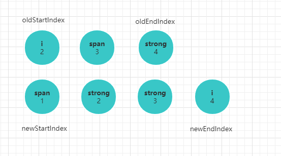

> 这一节，依然是**深入剖析Vue源码系列**，上几节内容介绍了```Virtual DOM```是Vue在渲染机制上做的优化，而渲染的核心在于数据变化时，如何高效的更新节点，这就是diff算法。由于源码中关于```diff```算法部分流程复杂，直接剖析每个流程不易于理解，所以这一节我们换一个思路，参考源码来手动实现一个简易版的```diff```算法。

之前讲到```Vue```在渲染机制的优化上，引入了```Virtual DOM```的概念，利用```Virtual DOM```描述一个真实的```DOM```,本质上是在```JS```和真实```DOM```之间架起了一层缓冲层。当我们通过大量的```JS```运算,并将最终结果反应到浏览器进行渲染时，```Virtual DOM```可以将多个改动合并成一个批量的操作，从而减少 ```dom``` 重排的次数，进而缩短了生成渲染树和绘制节点所花的时间，达到渲染优化的目的。之前的章节，我们简单的介绍了```Vue```中```Vnode```的概念，以及创建```Vnode```到```渲染Vnode```再到真实```DOM```的过程。如果有忘记流程的，可以参考前面的章节分析。


**从```render```函数到创建虚拟```DOM```,再到渲染真实节点，这一过程是完整的，也是容易理解的。然而引入虚拟```DOM```的核心不在这里，而在于当数据发生变化时，如何最优化数据变动到视图更新的过程。这一个过程才是```Vnode```更新视图的核心，也就是常说的```diff```算法。**下面跟着我来实现一个简易版的```diff```算法

## 8.1 创建基础类
代码编写过程会遇到很多基本类型的判断，第一步需要先将这些方法封装。
```js
class Util {
  constructor() {}
  // 检测基础类型
  _isPrimitive(value) {
    return (typeof value === 'string' || typeof value === 'number' || typeof value === 'symbol' || typeof value === 'boolean')
  }
  // 判断值不为空
  _isDef(v) {
    return v !== undefined && v !== null
  }
}
// 工具类的使用
const util = new Util()
```

## 8.2 创建Vnode
`Vnode`这个类在之前章节已经分析过源码，本质上是用一个对象去描述一个真实的```DOM```元素，简易版关注点在于元素的```tag```标签，元素的属性集合```data```,元素的子节点```children```,```text```为元素的文本节点,简单的描述类如下：
```js
class VNode {
  constructor(tag, data, children) {
    this.tag = tag;
    this.data = data;
    this.children = children;
    this.elm = ''
    // text属性用于标志Vnode节点没有其他子节点，只有纯文本
    this.text = util._isPrimitive(this.children) ? this.children : ''
  }
}
```
## 8.3 模拟渲染过程
接下来需要创建另一个类模拟将```render```函数转换为```Vnode```,并将```Vnode```渲染为真实```DOM```的过程，我们将这个类定义为```Vn```,```Vn```具有两个基本的方法```createVnode, createElement```, 分别实现创建虚拟```Vnode```,和创建真实```DOM```的过程。

### 8.3.1 createVnode
`createVnode`模拟```Vue```中```render```函数的实现思路，目的是将数据转换为虚拟的```Vnode```,先看具体的使用和定义。

```js
// index.html

<script src="diff.js">
<script>

// 创建Vnode

let createVnode = function() {
  let _c = vn.createVnode;
  return _c('div', { attrs: { id: 'test' } }, arr.map(a => _c(a.tag, {}, a.text)))
}

// 元素内容结构
let arr = 
  [{
    tag: 'i',
    text: 2
  }, {
    tag: 'span',
    text: 3
  }, {
    tag: 'strong',
    text: 4
  }]
</script>


// diff.js
(function(global) {
  class Vn {
    constructor() {}
    // 创建虚拟Vnode
    createVnode(tag, data, children) {
      return new VNode(tag, data, children)
    }
  }
  global.vn = new Vn()
}(this))

```
这是一个完整的```Vnode```对象，我们已经可以用这个对象来简单的描述一个```DOM```节点，而```createElement```就是将这个对象对应到真实节点的过程。最终我们希望的结果是这样的。

**Vnode对象**


**渲染结果**


### 8.3.2 createElement
渲染真实```DOM```的过程就是遍历```Vnode```对象，递归创建真实节点的过程，这个不是本文的重点，所以我们可以粗糙的实现。
```js
class Vn {
  createElement(vnode, options) {
      let el = options.el;
      if(!el || !document.querySelector(el)) return console.error('无法找到根节点')
      let _createElement = vnode => {
        const { tag, data, children } = vnode;
        const ele = document.createElement(tag);
        // 添加属性
        this.setAttr(ele, data);
        // 简单的文本节点，只要创建文本节点即可
        if (util._isPrimitive(children)) {
          const testEle = document.createTextNode(children);
          ele.appendChild(testEle)
        } else {
        // 复杂的子节点需要遍历子节点递归创建节点。
          children.map(c => ele.appendChild(_createElement(c)))
        }
        return ele
      }
      document.querySelector(el).appendChild(_createElement(vnode))
    }
}
```
### 8.3.3 setAttr
`setAttr`是为节点设置属性的方法，利用```DOM```原生的```setAttribute```为每个节点设置属性值。
```js
class Vn {
  setAttr(el, data) {
    if (!el) return
    const attrs = data.attrs;
    if (!attrs) return;
    Object.keys(attrs).forEach(a => {
      el.setAttribute(a, attrs[a]);
    })
  }
}
```
至此一个简单的 **数据 -> ```Virtual DOM``` => 真实```DOM```**的模型搭建成功,这也是数据变化、比较、更新的基础。


## 8.4 diff算法实现
更新组件的过程首先是响应式数据发生了变化,数据频繁的修改如果直接渲染到真实```DOM```上会引起整个```DOM```树的重绘和重排，频繁的重绘和重排是极其消耗性能的。如何优化这一渲染过程，```Vue```源码中给出了两个具体的思路，其中一个是在介绍响应式系统时提到的将多次修改推到一个队列中，在下一个```tick```去执行视图更新，另一个就是接下来要着重介绍的```diff```算法，将需要修改的数据进行比较，并只渲染必要的```DOM```。

数据的改变最终会导致节点的改变，所以```diff```算法的核心在于在尽可能小变动的前提下找到需要更新的节点，直接调用原生相关```DOM```方法修改视图。不管是真实```DOM```还是前面创建的```Virtual DOM```,都可以理解为一颗```DOM```树，**算法比较节点不同时，只会进行同层节点的比较，不会跨层进行比较，这也大大减少了算法复杂度。**


### 8.4.1 diffVnode
在之前的基础上，我们实现一个思路，1秒之后数据发生改变。
```js
// index.html
setTimeout(function() {
  arr = [{
    tag: 'span',
    text: 1
  },{
    tag: 'strong',
    text: 2
  },{
    tag: 'i',
    text: 3
  },{
    tag: 'i',
    text: 4
  }]
  // newVnode 表示改变后新的Vnode树
  const newVnode = createVnode();
  // diffVnode会比较新旧Vnode树，并完成视图更新
  vn.diffVnode(newVnode, preVnode);
})
```
`diffVnode`的逻辑，会对比新旧节点的不同，并完成视图渲染更新
```js
class Vn {
  ···
  diffVnode(nVnode, oVnode) {
    if (!this._sameVnode(nVnode, oVnode)) {
      // 直接更新根节点及所有子节点
      return ***
    }
    this.generateElm(vonde);
    this.patchVnode(nVnode, oVnode);
  }
}
```
### 8.4.2 _sameVnode
新旧节点的对比是算法的第一步，如果新旧节点的根节点不是同一个节点，则直接替换节点。这遵从上面提到的原则，**只进行同层节点的比较，节点不一致，直接用新节点及其子节点替换旧节点**。为了理解方便，我们假定节点相同的判断是```tag```标签是否一致(实际源码要复杂)。
```js
class Vn {
  _sameVnode(n, o) {
    return n.tag === o.tag;
  }
}
```
### 8.4.3 generateElm
`generateElm`的作用是跟踪每个节点实际的真实节点，方便在对比虚拟节点后实时更新真实```DOM```节点。虽然```Vue```源码中做法不同，但是这不是分析```diff```的重点。
```js
class Vn {
  generateElm(vnode) {
    const traverseTree = (v, parentEl) => {
      let children = v.children;
      if(Array.isArray(children)) {
        children.forEach((c, i) => {
          c.elm = parentEl.childNodes[i];
          traverseTree(c, c.elm)
        })
      }
    }
    traverseTree(vnode, this.el);
  }
}
```
执行```generateElm```方法后，我们可以在旧节点的```Vnode```中跟踪到每个```Virtual DOM```的真实节点信息。

### 8.4.4 patchVnode
`patchVnode`是新旧```Vnode```对比的核心方法，对比的逻辑如下。
1. 节点相同，且节点除了拥有文本节点外没有其他子节点。这种情况下直接替换文本内容。
2. 新节点没有子节点，旧节点有子节点，则删除旧节点所有子节点。
3. 旧节点没有子节点，新节点有子节点，则用新的所有子节点去更新旧节点。
4. 新旧都存在子节点。则对比子节点内容做操作。

代码逻辑如下：
```js
class Vn {
  patchVnode(nVnode, oVnode) {
    
    if(nVnode.text && nVnode.text !== oVnode) {
      // 当前真实dom元素
      let ele = oVnode.elm
      // 子节点为文本节点
      ele.textContent = nVnode.text;
    } else {
      const oldCh = oVnode.children;
      const newCh = nVnode.children;
      // 新旧节点都存在。对比子节点
      if (util._isDef(oldCh) && util._isDef(newCh)) {
        this.updateChildren(ele, newCh, oldCh)
      } else if (util._isDef(oldCh)) {
        // 新节点没有子节点
      } else {
        // 老节点没有子节点
      }
    }
  }
}
```
上述例子在```patchVnode```过程中，新旧子节点都存在，所以会走```updateChildren```分支。

### 8.4.5 updateChildren
子节点的对比，我们通过文字和画图的形式分析，通过图解的形式可以很清晰看到```diff```算法的巧妙之处。

大致逻辑是：
 1. 旧节点的起始位置为```oldStartIndex```,截至位置为```oldEndIndex```,新节点的起始位置为```newStartIndex```,截至位置为```newEndIndex```。
 2. 新旧```children```的起始位置的元素两两对比，顺序是```newStartVnode, oldStartVnode```; ```newEndVnode, oldEndVnode```;```newEndVnode, oldStartVnode```;```newStartIndex, oldEndIndex```
 3. ```newStartVnode, oldStartVnode```节点相同，执行一次```patchVnode```过程，也就是递归对比相应子节点，并替换节点的过程。```oldStartIndex，newStartIndex```都像右移动一位。
 4. ```newEndVnode, oldEndVnode```节点相同，执行一次```patchVnode```过程，递归对比相应子节点，并替换节点。```oldEndIndex， newEndIndex```都像左移动一位。
 5. ```newEndVnode, oldStartVnode```节点相同，执行一次```patchVnode```过程，并将旧的```oldStartVnode```移动到尾部,```oldStartIndex```右移一味，```newEndIndex```左移一位。
 6. ```newStartIndex, oldEndIndex```节点相同，执行一次```patchVnode```过程，并将旧的```oldEndVnode```移动到头部,```oldEndIndex```左移一味，```newStartIndex```右移一位。
 7. 四种组合都不相同，则会搜索旧节点所有子节点，找到将这个旧节点和```newStartVnode```执行```patchVnode```过程。
 8. 不断对比的过程使得```oldStartIndex```不断逼近```oldEndIndex```，```newStartIndex```不断逼近```newEndIndex```。当```oldEndIndex <= oldStartIndex```说明旧节点已经遍历完了，此时只要批量增加新节点即可。当```newEndIndex <= newStartIndex```说明旧节点还有剩下，此时只要批量删除旧节点即可。


结合前面的例子：
 
 
第一步： 



第二步：


第三步：


第三步：


第四步：


根据这些步骤，代码实现如下： 

```js
class Vn {
  updateChildren(el, newCh, oldCh) {
    // 新children开始标志
    let newStartIndex = 0;
    // 旧children开始标志
    let oldStartIndex = 0;
    // 新children结束标志
    let newEndIndex = newCh.length - 1;
    // 旧children结束标志
    let oldEndIndex = oldCh.length - 1;
    let oldKeyToId;
    let idxInOld;
    let newStartVnode = newCh[newStartIndex];
    let oldStartVnode = oldCh[oldStartIndex];
    let newEndVnode = newCh[newEndIndex];
    let oldEndVnode = oldCh[oldEndIndex];
    // 遍历结束条件
    while (newStartIndex <= newEndIndex && oldStartIndex <= oldEndIndex) {
      // 新children开始节点和旧开始节点相同
      if (this._sameVnode(newStartVnode, oldStartVnode)) {
        this.patchVnode(newCh[newStartIndex], oldCh[oldStartIndex]);
        newStartVnode = newCh[++newStartIndex];
        oldStartVnode = oldCh[++oldStartIndex]
      } else if (this._sameVnode(newEndVnode, oldEndVnode)) {
      // 新childre结束节点和旧结束节点相同
        this.patchVnode(newCh[newEndIndex], oldCh[oldEndIndex])
        oldEndVnode = oldCh[--oldEndIndex];
        newEndVnode = newCh[--newEndIndex]
      } else if (this._sameVnode(newEndVnode, oldStartVnode)) {
      // 新childre结束节点和旧开始节点相同
        this.patchVnode(newCh[newEndIndex], oldCh[oldStartIndex])
        // 旧的oldStartVnode移动到尾部
        el.insertBefore(oldCh[oldStartIndex].elm, null);
        oldStartVnode = oldCh[++oldStartIndex];
        newEndVnode = newCh[--newEndIndex];
      } else if (this._sameVnode(newStartVnode, oldEndVnode)) {
        // 新children开始节点和旧结束节点相同
        this.patchVnode(newCh[newStartIndex], oldCh[oldEndIndex]);
        el.insertBefore(oldCh[oldEndIndex].elm, oldCh[oldStartIndex].elm);
        oldEndVnode = oldCh[--oldEndIndex];
        newStartVnode = newCh[++newStartIndex];
      } else {
        // 都不符合的处理，查找新节点中与对比旧节点相同的vnode
        this.findIdxInOld(newStartVnode, oldCh, oldStartIdx, oldEndIdx);
      }
    }
    // 新节点比旧节点多，批量增加节点
    if(oldEndIndex <= oldStartIndex) {
      for (let i = newStartIndex; i <= newEndIndex; i++) {
        // 批量增加节点
        this.createElm(oldCh[oldEndIndex].elm, newCh[i])
      }
    }
  }

  createElm(el, vnode) {
    let tag = vnode.tag;
    const ele = document.createElement(tag);
    this._setAttrs(ele, vnode.data);
    const testEle = document.createTextNode(vnode.children);
    ele.appendChild(testEle)
    el.parentNode.insertBefore(ele, el.nextSibling)
  }

  // 查找匹配值
  findIdxInOld(newStartVnode, oldCh, start, end) {
    for (var i = start; i < end; i++) {
      var c = oldCh[i];
      if (util.isDef(c) && this.sameVnode(newStartVnode, c)) { return i }
    }
  }
}
```

## 8.5 diff算法优化
前面有个分支，当四种比较节点都找不到匹配时，会调用```findIdxInOld```找到旧节点中和新的比较节点一致的节点。节点搜索在数量级较大时是缓慢的。查看```Vue```的源码，发现它在这一个环节做了优化，也就是我们经常在编写列表时被要求加入的唯一属性**key**，有了这个唯一的标志位，我们可以对旧节点建立简单的字典查询，只要有```key```值便可以方便的搜索到符合要求的旧节点。修改代码：
```js
class Vn {
  updateChildren() {
    ···
    } else {
      // 都不符合的处理，查找新节点中与对比旧节点相同的vnode
      if (!oldKeyToId) oldKeyToId = this.createKeyMap(oldCh, oldStartIndex, oldEndIndex);
      idxInOld = util._isDef(newStartVnode.key) ? oldKeyToId[newStartVnode.key] : this.findIdxInOld(newStartVnode, oldCh, oldStartIndex, oldEndIndex);
      // 后续操作
    }
  }
  // 建立字典
  createKeyMap(oldCh, start, old) {
    const map = {};
    for(let i = start; i < old; i++) {
      if(oldCh.key) map[key] = i;
    }
    return map;
  }
}


```

## 8.6 问题思考
最后我们思考一个问题，```Virtual DOM``` 的重绘性能真的比单纯的```innerHTML```要好吗，其实并不是这样的，作者的[解释](https://www.zhihu.com/question/31809713/answer/53544875)

>  - `innerHTML:  render html string O(template size) +` 重新创建所有 ```DOM``` 元素 ```O(DOM size)```

> - `Virtual DOM: render Virtual DOM + diff O(template size) +` 必要的 ```DOM``` 更新 ```O(DOM change)```

> - `Virtual DOM render + diff` 显然比渲染 html 字符串要慢，但是！它依然是纯 js 层面的计算，比起后面的 ```DOM``` 操作来说，依然便宜了太多。可以看到，```innerHTML``` 的总计算量不管是 ```js``` 计算还是 ```DOM ```操作都是和整个界面的大小相关，但```Virtual DOM``` 的计算量里面，只有 ```js``` 计算和界面大小相关，DOM 操作是和数据的变动量相关的。
