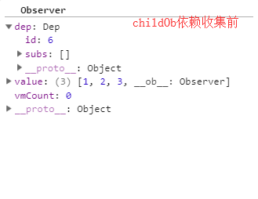
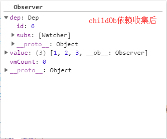

> 上一节，我们深入分析了以```data,computed```为数据创建响应式系统的过程，并对其中依赖收集和派发更新的过程进行了详细的分析。然而在使用和分析过程中依然存在或多或少的问题，这一节我们将针对这些问题展开分析，最后我们也会分析一下```watch```的响应式过程。这篇文章将作为响应式系统分析的完结篇。

## 7.12 数组检测
在之前介绍数据代理章节，我们已经详细介绍过```Vue```数据代理的技术是利用了```Object.defineProperty```,```Object.defineProperty```让我们可以方便的利用存取描述符中的```getter/setter```来进行数据的监听,在```get,set```钩子中分别做不同的操作，达到数据拦截的目的。然而```Object.defineProperty```的```get,set```方法只能检测到对象属性的变化，对于数组的变化(例如插入删除数组元素等操作)，```Object.defineProperty```却无法达到目的,这也是利用```Object.defineProperty```进行数据监控的缺陷，虽然```es6```中的```proxy```可以完美解决这一问题，但毕竟有兼容性问题，所以我们还需要研究```Vue```在```Object.defineProperty```的基础上如何对数组进行监听检测。

### 7.12.1 数组方法的重写
既然数组已经不能再通过数据的```getter,setter```方法去监听变化了，```Vue```的做法是对数组方法进行重写，在保留原数组功能的前提下，对数组进行额外的操作处理。也就是重新定义了数组方法。

```js
var arrayProto = Array.prototype;
// 新建一个继承于Array的对象
var arrayMethods = Object.create(arrayProto);

// 数组拥有的方法
var methodsToPatch = [
  'push',
  'pop',
  'shift',
  'unshift',
  'splice',
  'sort',
  'reverse'
];
```
`arrayMethods`是基于原始```Array```类为原型继承的一个对象类，由于原型链的继承，```arrayMethod```拥有数组的所有方法，接下来对这个新的数组类的方法进行改写。
```js
methodsToPatch.forEach(function (method) {
  // 缓冲原始数组的方法
  var original = arrayProto[method];
  // 利用Object.defineProperty对方法的执行进行改写
  def(arrayMethods, method, function mutator () {});
});

function def (obj, key, val, enumerable) {
    Object.defineProperty(obj, key, {
      value: val,
      enumerable: !!enumerable,
      writable: true,
      configurable: true
    });
  }

```

这里对数组方法设置了代理，当执行```arrayMethods```的数组方法时，会代理执行```mutator```函数，这个函数的具体实现，我们放到数组的派发更新中介绍。


**仅仅创建一个新的数组方法合集是不够的，我们在访问数组时，如何不调用原生的数组方法，而是将过程指向这个新的类，这是下一步的重点。**

回到数据初始化过程，也就是执行```initData```阶段，上一篇内容花了大篇幅介绍过数据初始化会为```data```数据创建一个```Observer```类，当时我们只讲述了```Observer```类会为每个非数组的属性进行数据拦截，重新定义```getter,setter```方法,除此之外对于数组类型的数据，我们有意跳过分析了。这里，我们重点看看对于数组拦截的处理。

```js
var Observer = function Observer (value) {
  this.value = value;
  this.dep = new Dep();
  this.vmCount = 0;
  // 将__ob__属性设置成不可枚举属性。外部无法通过遍历获取。
  def(value, '__ob__', this);
  // 数组处理
  if (Array.isArray(value)) {
    if (hasProto) {
      protoAugment(value, arrayMethods);
    } else {
      copyAugment(value, arrayMethods, arrayKeys);
    }
    this.observeArray(value);
  } else {
  // 对象处理
    this.walk(value);
  }
}
```
数组处理的分支分为两个，```hasProto```的判断条件，```hasProto```用来判断当前环境下是否支持```__proto__```属性。而数组的处理会根据是否支持这一属性来决定执行```protoAugment, copyAugment```过程，

```js
// __proto__属性的判断
var hasProto = '__proto__' in {};
```

**当支持```__proto__```时，执行```protoAugment```会将当前数组的原型指向新的数组类```arrayMethods```,如果不支持```__proto__```，则通过代理设置，在访问数组方法时代理访问新数组类中的数组方法。**
```js
//直接通过原型指向的方式

function protoAugment (target, src) {
  target.__proto__ = src;
}

// 通过数据代理的方式
function copyAugment (target, src, keys) {
  for (var i = 0, l = keys.length; i < l; i++) {
    var key = keys[i];
    def(target, key, src[key]);
  }
}
```
有了这两步的处理，接下来我们在实例内部调用```push, unshift```等数组的方法时，会执行```arrayMethods```类的方法。这也是数组进行依赖收集和派发更新的前提。


### 7.12.2 依赖收集
由于数据初始化阶段会利用```Object.definePrototype```进行数据访问的改写，数组的访问同样会被```getter```所拦截。由于是数组，拦截过程会做特殊处理，后面我们再看看```dependArray```的原理。
```js
function defineReactive###1() {
  ···
  var childOb = !shallow && observe(val);

  Object.defineProperty(obj, key, {
        enumerable: true,
        configurable: true,
        get: function reactiveGetter () {
          var value = getter ? getter.call(obj) : val;
          if (Dep.target) {
            dep.depend();
            if (childOb) {
              childOb.dep.depend();
              if (Array.isArray(value)) {
                dependArray(value);
              }
            }
          }
          return value
        },
        set() {}
}
 
```
`childOb`是标志属性值是否为基础类型的标志，```observe```如果遇到基本类型数据，则直接返回，不做任何处理，如果遇到对象或者数组则会递归实例化```Observer```，会为每个子属性设置响应式数据，最终返回```Observer```实例。而实例化```Observer```又回到之前的老流程：
  **添加```__ob__```属性，如果遇到数组则进行原型重指向，遇到对象则定义```getter,setter```，这一过程前面分析过，就不再阐述。**


在访问到数组时，由于```childOb```的存在，会执行```childOb.dep.depend();```进行依赖收集，该```Observer```实例的```dep```属性会收集当前的```watcher```作为依赖保存，```dependArray```保证了如果数组元素是数组或者对象，需要递归去为内部的元素收集相关的依赖。
```js
function dependArray (value) {
    for (var e = (void 0), i = 0, l = value.length; i < l; i++) {
      e = value[i];
      e && e.__ob__ && e.__ob__.dep.depend();
      if (Array.isArray(e)) {
        dependArray(e);
      }
    }
  }

```

我们可以通过截图看最终依赖收集的结果。

收集前



收集后




### 7.12.3 派发更新
当调用数组的方法去添加或者删除数据时，数据的```setter```方法是无法拦截的，所以我们唯一可以拦截的过程就是调用数组方法的时候，前面介绍过，数组方法的调用会代理到新类```arrayMethods```的方法中,而```arrayMethods```的数组方法是进行重写过的。具体我们看他的定义。

```js
 methodsToPatch.forEach(function (method) {
    var original = arrayProto[method];
    def(arrayMethods, method, function mutator () {
      var args = [], len = arguments.length;
      while ( len-- ) args[ len ] = arguments[ len ];
      // 执行原数组方法
      var result = original.apply(this, args);
      var ob = this.__ob__;
      var inserted;
      switch (method) {
        case 'push':
        case 'unshift':
          inserted = args;
          break
        case 'splice':
          inserted = args.slice(2);
          break
      }
      if (inserted) { ob.observeArray(inserted); }
      // notify change
      ob.dep.notify();
      return result
    });
  });

```
`mutator`是重写的数组方法，首先会调用原始的数组方法进行运算，这保证了与原始数组类型的方法一致性，```args```保存了数组方法调用传递的参数。之后取出数组的```__ob__```也就是之前保存的```Observer```实例，调用```ob.dep.notify();```进行依赖的派发更新，前面知道了。```Observer```实例的```dep```是```Dep```的实例，他收集了需要监听的```watcher```依赖，而```notify```会对依赖进行重新计算并更新。具体看```Dep.prototype.notify = function notify () {}```函数的分析，这里也不重复赘述。

回到代码中，```inserted```变量用来标志数组是否是增加了元素，如果增加的元素不是原始类型，而是数组对象类型，则需要触发```observeArray```方法，对每个元素进行依赖收集。

```js
Observer.prototype.observeArray = function observeArray (items) {
  for (var i = 0, l = items.length; i < l; i++) {
    observe(items[i]);
  }
};
```
**总的来说。数组的改变不会触发```setter```进行依赖更新，所以```Vue```创建了一个新的数组类，重写了数组的方法，将数组方法指向了新的数组类。同时在访问到数组时依旧触发```getter```进行依赖收集，在更改数组时，触发数组新方法运算，并进行依赖的派发。**

现在我们回过头看看Vue的官方文档对于数组检测时的注意事项：
> ```Vue``` 不能检测以下数组的变动:
> - 当你利用索引直接设置一个数组项时，例如：```vm.items[indexOfItem] = newValue```
> - 当你修改数组的长度时，例如：```vm.items.length = newLength```

显然有了上述的分析我们很容易理解数组检测带来的弊端，即使```Vue```重写了数组的方法，以便在设置数组时进行拦截处理，但是不管是通过索引还是直接修改长度，都是无法触发依赖更新的。


## 7.13 对象检测异常
我们在实际开发中经常遇到一种场景，对象```test: { a: 1 }```要添加一个属性```b```,这时如果我们使用```test.b = 2```的方式去添加，这个过程```Vue```是无法检测到的，理由也很简单。我们在对对象进行依赖收集的时候，会为对象的每个属性都进行收集依赖，而直接通过```test.b```添加的新属性并没有依赖收集的过程，因此当之后数据```b```发生改变时也不会进行依赖的更新。

了解决这一问题，```Vue```提供了```Vue.set(object, propertyName, value)```的静态方法和```vm.$set(object, propertyName, value)```的实例方法，我们看具体怎么完成新属性的依赖收集过程。
```js
Vue.set = set
function set (target, key, val) {
    //target必须为非空对象
    if (isUndef(target) || isPrimitive(target)
    ) {
      warn(("Cannot set reactive property on undefined, null, or primitive value: " + ((target))));
    }
    // 数组场景，调用重写的splice方法，对新添加属性收集依赖。
    if (Array.isArray(target) && isValidArrayIndex(key)) {
      target.length = Math.max(target.length, key);
      target.splice(key, 1, val);
      return val
    }
    // 新增对象的属性存在时，直接返回新属性，触发依赖收集
    if (key in target && !(key in Object.prototype)) {
      target[key] = val;
      return val
    }
    // 拿到目标源的Observer 实例
    var ob = (target).__ob__;
    if (target._isVue || (ob && ob.vmCount)) {
      warn(
        'Avoid adding reactive properties to a Vue instance or its root $data ' +
        'at runtime - declare it upfront in the data option.'
      );
      return val
    }
    // 目标源对象本身不是一个响应式对象，则不需要处理
    if (!ob) {
      target[key] = val;
      return val
    }
    // 手动调用defineReactive，为新属性设置getter,setter
    defineReactive###1(ob.value, key, val);
    ob.dep.notify();
    return val
  }
```
按照分支分为不同的四个处理逻辑：
1. 目标对象必须为非空的对象，可以是数组，否则抛出异常。
2. 如果目标对象是数组时，调用数组的```splice```方法，而前面分析数组检测时，遇到数组新增元素的场景，会调用```ob.observeArray(inserted)```对数组新增的元素收集依赖。
3. 新增的属性值在原对象中已经存在，则手动访问新的属性值，这一过程会触发依赖收集。
4. 手动定义新属性的```getter,setter```方法，并通过```notify```触发依赖更新。


## 7.14 nextTick

在上一节的内容中，我们说到数据修改时会触发```setter```方法进行依赖的派发更新，而更新时会将每个```watcher```推到队列中，等待下一个```tick```到来时再执行```DOM```的渲染更新操作。这个就是异步更新的过程。为了说明异步更新的概念，需要牵扯到浏览器的事件循环机制和最优的渲染时机问题。由于这不是文章的主线，我只用简单的语言概述。

### 7.14.1 事件循环机制

1. 完整的事件循环机制需要了解两种异步队列：```macro-task```和```micro-task```
2. ```macro-task```常见的有 ```setTimeout, setInterval, setImmediate, script脚本, I/O操作，UI渲染```
3. ```micro-task```常见的有 ```promise, process.nextTick, MutationObserver```等
4. 完整事件循环流程为：
  4.1 ```micro-task```空，```macro-task```队列只有```script```脚本，推出```macro-task```的```script```任务执行，脚本执行期间产生的```macro-task，micro-task```推到对应的队列中
  4.2 执行全部```micro-task```里的微任务事件
  4.3 执行```DOM```操作，渲染更新页面
  4.4 执行```web worker```等相关任务
  4.5 循环，取出```macro-task```中一个宏任务事件执行，重复4的操作。


从上面的流程中我们可以发现，最好的渲染过程发生在微任务队列的执行过程中，此时他离页面渲染过程最近，因此我们可以借助微任务队列来实现异步更新，它可以让复杂批量的运算操作运行在JS层面，而视图的渲染只关心最终的结果，这大大降低了性能的损耗。
  
举一个这一做法好处的例子： 
  由于```Vue```是数据驱动视图更新渲染，如果我们在一个操作中重复对一个响应式数据进行计算，例如 在一个循环中执行```this.num ++ ```一千次，由于响应式系统的存在，数据变化触发```setter```，```setter```触发依赖派发更新，更新调用```run```进行视图的重新渲染。这一次循环，视图渲染要执行一千次，很明显这是很浪费性能的，我们只需要关注最后第一千次在界面上更新的结果而已。所以利用异步更新显得格外重要。

### 7.14.2 基本实现

`Vue`用一个```queue```收集依赖的执行，在下次微任务执行的时候统一执行```queue```中```Watcher```的```run```操作,与此同时，相同```id```的```watcher```不会重复添加到```queue```中,因此也不会重复执行多次的视图渲染。我们看```nextTick```的实现。

```js
// 原型上定义的方法
Vue.prototype.$nextTick = function (fn) {
  return nextTick(fn, this)
};
// 构造函数上定义的方法
Vue.nextTick = nextTick;

// 实际的定义
var callbacks = [];
function nextTick (cb, ctx) {
    var _resolve;
    // callbacks是维护微任务的数组。
    callbacks.push(function () {
      if (cb) {
        try {
          cb.call(ctx);
        } catch (e) {
          handleError(e, ctx, 'nextTick');
        }
      } else if (_resolve) {
        _resolve(ctx);
      }
    });
    if (!pending) {
      pending = true;
      // 将维护的队列推到微任务队列中维护
      timerFunc();
    }
    // nextTick没有传递参数，且浏览器支持Promise,则返回一个promise对象
    if (!cb && typeof Promise !== 'undefined') {
      return new Promise(function (resolve) {
        _resolve = resolve;
      })
    }
  }
```

`nextTick`定义为一个函数，使用方式为```Vue.nextTick( [callback, context] )```,当```callback```经过```nextTick```封装后，```callback```会在下一个```tick```中执行调用。从实现上，```callbacks```是一个维护了需要在下一个```tick```中执行的任务的队列，它的每个元素都是需要执行的函数。```pending```是判断是否在等待执行微任务队列的标志。而```timerFunc```是真正将任务队列推到微任务队列中的函数。我们看```timerFunc```的实现。


1.如果浏览器执行```Promise```,那么默认以```Promsie```将执行过程推到微任务队列中。

```js
var timerFunc;

if (typeof Promise !== 'undefined' && isNative(Promise)) {
  var p = Promise.resolve();
  timerFunc = function () {
    p.then(flushCallbacks);
    // 手机端的兼容代码
    if (isIOS) { setTimeout(noop); }
  };
  // 使用微任务队列的标志
  isUsingMicroTask = true;
}
```

`flushCallbacks`是异步更新的函数，他会取出callbacks数组的每一个任务，执行任务，具体定义如下：
```js
function flushCallbacks () {
  pending = false;
  var copies = callbacks.slice(0);
  // 取出callbacks数组的每一个任务，执行任务
  callbacks.length = 0;
  for (var i = 0; i < copies.length; i++) {
    copies[i]();
  }
}
```

2.不支持```promise```,支持```MutataionObserver```

```js
else if (!isIE && typeof MutationObserver !== 'undefined' && (
    isNative(MutationObserver) ||
    // PhantomJS and iOS 7.x
    MutationObserver.toString() === '[object MutationObserverConstructor]'
  )) {
    var counter = 1;
    var observer = new MutationObserver(flushCallbacks);
    var textNode = document.createTextNode(String(counter));
    observer.observe(textNode, {
      characterData: true
    });
    timerFunc = function () {
      counter = (counter + 1) % 2;
      textNode.data = String(counter);
    };
    isUsingMicroTask = true;
  }
```

3.如果不支持微任务方法，则会使用宏任务方法，```setImmediate```会先被使用

```js
 else if (typeof setImmediate !== 'undefined' && isNative(setImmediate)) {
    // Fallback to setImmediate.
    // Techinically it leverages the (macro) task queue,
    // but it is still a better choice than setTimeout.
    timerFunc = function () {
      setImmediate(flushCallbacks);
    };
  }
```
4.所有方法都不适合，会使用宏任务方法中的```setTimeout```

```js
else {
  timerFunc = function () {
    setTimeout(flushCallbacks, 0);
  };
}
```

**当```nextTick```不传递任何参数时，可以作为一个```promise```用**，例如：
```js
nextTick().then(() => {})
```

### 7.14.3 使用场景
说了这么多原理性的东西，回过头来看看```nextTick```的使用场景，由于异步更新的原理，我们在某一时间改变的数据并不会触发视图的更新，而是需要等下一个```tick```到来时才会更新视图，下面是一个典型场景：

```js
<input v-if="show" type="text" ref="myInput">

// js
data() {
  show: false
},
mounted() {
  this.show = true;
  this.$refs.myInput.focus();// 报错
}
```
数据改变时，视图并不会同时改变，因此需要使用```nextTick```
```js
mounted() {
  this.show = true;
  this.$nextTick(function() {
    this.$refs.myInput.focus();// 正常
  })
}
```

## 7.15 watch
到这里，关于响应式系统的分析大部分内容已经分析完毕，我们上一节还遗留着一个问题，```Vue```对用户手动添加的```watch```如何进行数据拦截。我们先看看两种基本的使用形式。
```js
// watch选项
var vm = new Vue({
  el: '#app',
  data() {
    return {
      num: 12
    }
  },
  watch: {
    num() {}
  }
})
vm.num = 111

// $watch api方式
vm.$watch('num', function() {}, {
  deep: ,
  immediate: ,
})
```

### 7.15.1 依赖收集
我们以```watch```选项的方式来分析```watch```的细节，同样从初始化说起，初始化数据会执行```initWatch```,```initWatch```的核心是```createWatcher```。

```js
function initWatch (vm, watch) {
    for (var key in watch) {
      var handler = watch[key];
      // handler可以是数组的形式，执行多个回调
      if (Array.isArray(handler)) {
        for (var i = 0; i < handler.length; i++) {
          createWatcher(vm, key, handler[i]);
        }
      } else {
        createWatcher(vm, key, handler);
      }
    }
  }

  function createWatcher (vm,expOrFn,handler,options) {
    // 针对watch是对象的形式，此时回调回选项中的handler
    if (isPlainObject(handler)) {
      options = handler;
      handler = handler.handler;
    }
    if (typeof handler === 'string') {
      handler = vm[handler];
    }
    return vm.$watch(expOrFn, handler, options)
  }
```
无论是选项的形式，还是```api```的形式，最终都会调用实例的```$watch```方法，其中```expOrFn```是监听的字符串，```handler```是监听的回调函数，```options```是相关配置。我们重点看看```$watch```的实现。
```js
Vue.prototype.$watch = function (expOrFn,cb,options) {
    var vm = this;
    if (isPlainObject(cb)) {
      return createWatcher(vm, expOrFn, cb, options)
    }
    options = options || {};
    options.user = true;
    var watcher = new Watcher(vm, expOrFn, cb, options);
    // 当watch有immediate选项时，立即执行cb方法，即不需要等待属性变化，立刻执行回调。
    if (options.immediate) {
      try {
        cb.call(vm, watcher.value);
      } catch (error) {
        handleError(error, vm, ("callback for immediate watcher \"" + (watcher.expression) + "\""));
      }
    }
    return function unwatchFn () {
      watcher.teardown();
    }
  };
}
```
`$watch`的核心是创建一个```user watcher```,```options.user```是当前用户定义```watcher```的标志。如果有```immediate```属性，则立即执行回调函数。
而实例化```watcher```时会执行一次```getter```求值，这时，```user watcher```会作为依赖被数据所收集。这个过程可以参考```data```的分析。

```js
var Watcher = function Watcher() {
  ···
  this.value = this.lazy
      ? undefined
      : this.get();
}

Watcher.prototype.get = function get() {
  ···
  try {
    // getter回调函数，触发依赖收集
    value = this.getter.call(vm, vm);
  } 
}
```

### 7.15.2 派发更新
`watch`派发更新的过程很好理解，数据发生改变时，```setter```拦截对依赖进行更新，而此前```user watcher```已经被当成依赖收集了。这个时候依赖的更新就是回调函数的执行。


## 7.16 小结
这一节是响应式系统构建的完结篇，```data,computed```如何进行响应式系统设计，这在上一节内容已经详细分析，这一节针对一些特殊场景做了分析。例如由于```Object.defineProperty```自身的缺陷，无法对数组的新增删除进行拦截检测，因此```Vue```对数组进行了特殊处理，重写了数组的方法，并在方法中对数据进行拦截。我们也重点介绍了```nextTick```的原理，利用浏览器的事件循环机制来达到最优的渲染时机。文章的最后补充了```watch```在响应式设计的原理，用户自定义的```watch```会创建一个依赖，这个依赖在数据改变时会执行回调。
