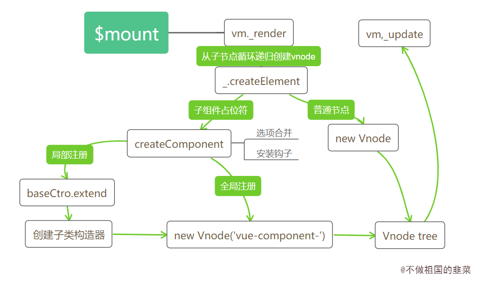
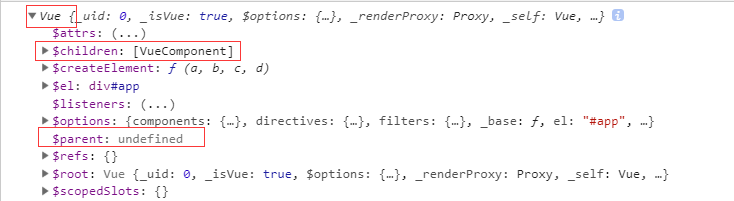
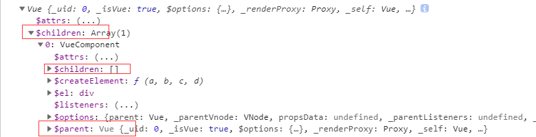

> 组件是```Vue```的一个重要核心，我们在进行项目工程化时，会将页面的结构组件化。组件化意味着独立和共享,而两个结论并不矛盾，独立的组件开发可以让开发者专注于某个功能项的开发和扩展，而组件的设计理念又使得功能项更加具有复用性，不同的页面可以进行组件功能的共享。对于开发者而言，编写```Vue```组件是掌握```Vue```开发的核心基础，```Vue```官网也花了大量的篇幅介绍了组件的体系和各种使用方法。这一节内容，我们会深入```Vue```组件内部的源码，了解**组件注册的实现思路，并结合上一节介绍的实例挂载分析组件渲染挂载的基本流程，最后我们将分析组件和组件之间是如何建立联系的**。我相信，掌握这些底层的实现思路对于我们今后在解决```vue```组件相关问题上会有明显的帮助。

## 5.1 组件两种注册方式
熟悉```Vue```开发流程的都知道，```Vue```组件在使用之前需要进行注册，而注册的方式有两种，全局注册和局部注册。在进入源码分析之前，我们先回忆一下两者的用法，以便后续掌握两者的差异。

### 5.1.1 全局注册
```js
Vue.component('my-test', {
    template: '<div>{{test}}</div>',
    data () {
        return {
            test: 1212
        }
    }
})
var vm = new Vue({
    el: '#app',
    template: '<div id="app"><my-test><my-test/></div>'
})
```
**其中组件的全局注册需要在全局实例化Vue前调用**,注册之后可以用在任何新创建的```Vue```实例中调用。
### 5.1.2 局部注册
```js
var myTest = {
    template: '<div>{{test}}</div>',
    data () {
        return {
            test: 1212
        }
    }
}
var vm = new Vue({
    el: '#app',
    component: {
        myTest
    }
})
```
当只需要在某个局部用到某个组件时，可以使用局部注册的方式进行组件注册，此时局部注册的组件只能在注册该组件内部使用。

### 5.1.3 注册过程
在简单回顾组件的两种注册方式后，我们来看注册过程到底发生了什么，我们以全局组件注册为例。它通过```Vue.component(name, {...})```进行组件注册，```Vue.component```是在```Vue```源码引入阶段定义的静态方法。
```js
// 初始化全局api
initAssetRegisters(Vue);
var ASSET_TYPES = [
    'component',
    'directive',
    'filter'
];
function initAssetRegisters(Vue){
    // 定义ASSET_TYPES中每个属性的方法，其中包括component
    ASSET_TYPES.forEach(function (type) {
    // type: component,directive,filter
      Vue[type] = function (id,definition) {
          if (!definition) {
            // 直接返回注册组件的构造函数
            return this.options[type + 's'][id]
          }
          ...
          if (type === 'component') {
            // 验证component组件名字是否合法
            validateComponentName(id);
          }
          if (type === 'component' && isPlainObject(definition)) {
            // 组件名称设置
            definition.name = definition.name || id;
            // Vue.extend() 创建子组件，返回子类构造器
            definition = this.options._base.extend(definition);
          }
          // 为Vue.options 上的component属性添加将子类构造器
          this.options[type + 's'][id] = definition;
          return definition
        }
    });
}
```

`Vue.components`有两个参数，一个是需要注册组件的组件名，另一个是组件选项，如果第二个参数没有传递，则会直接返回注册过的组件选项。否则意味着需要对该组件进行注册，注册过程先会对组件名的合法性进行检测，要求组件名不允许出现非法的标签，包括```Vue```内置的组件名，如```slot, component```等。
```js
function validateComponentName(name) {
    if (!new RegExp(("^[a-zA-Z][\\-\\.0-9_" + (unicodeRegExp.source) + "]*$")).test(name)) {
      // 正则判断检测是否为非法的标签
      warn(
        'Invalid component name: "' + name + '". Component names ' +
        'should conform to valid custom element name in html5 specification.'
      );
    }
    // 不能使用Vue自身自定义的组件名，如slot, component,不能使用html的保留标签，如 h1, svg等
    if (isBuiltInTag(name) || config.isReservedTag(name)) {
      warn(
        'Do not use built-in or reserved HTML elements as component ' +
        'id: ' + name
      );
    }
  }
```
在经过组件名的合法性检测后，会调用```extend```方法为组件创建一个子类构造器，此时的```this.options._base```代表的就是```Vue```构造器。```extend```方法的定义在介绍选项合并章节有重点介绍过，它会**基于父类去创建一个子类**，此时的父类是```Vue```，并且创建过程子类会继承父类的方法，并会和父类的选项进行合并，最终返回一个子类构造器。

代码处还有一个逻辑，```Vue.component()```默认会把第一个参数作为组件名称，但是如果组件选项有```name```属性时，```name```属性值会将组件名覆盖。


**总结起来，全局注册组件就是```Vue```实例化前创建一个基于```Vue```的子类构造器，并将组件的信息加载到实例```options.components```对象中。**


**接下来自然而然会想到一个问题，局部注册和全局注册在实现上的区别体现在哪里？**我们不急着分析局部组件的注册流程，先以全局注册的组件为基础，看看作为组件，它的挂载流程有什么不同。


## 5.2 组件Vnode创建
上一节内容我们介绍了```Vue```如何将一个模板，通过```render```函数的转换，最终生成一个```Vnode tree```的，在不包含组件的情况下，```_render```函数的最后一步是直接调用```new Vnode```去创建一个完整的```Vnode tree```。然而有一大部分的分支我们并没有分析，那就是遇到组件占位符的场景。执行阶段如果遇到组件，处理过程要比想像中复杂得多，我们通过一张流程图展开分析。

### 5.2.1 Vnode创建流程图



### 5.2.2 具体流程分析
我们结合实际的例子对照着流程图分析一下这个过程：

- 场景
```js
Vue.component('test', {
  template: '<span></span>'
})
var vm = new Vue({
  el: '#app',
  template: '<div><test></test></div>'
})
```
- 父```render```函数
```js
function() {
  with(this){return _c('div',[_c('test')],1)}
}
```


-  `Vue`根实例初始化会执行 ```vm.$mount(vm.$options.el)```实例挂载的过程，按照之前的逻辑，完整流程会经历```render```函数生成```Vnode```,以及```Vnode```生成真实```DOM```的过程。
- `render`函数生成```Vnode```过程中，子会优先父执行生成```Vnode```过程,也就是```_c('test')```函数会先被执行。```'test'```会先判断是普通的```html```标签还是组件的占位符。
- 如果为一般标签，会执行```new Vnode```过程，这也是上一章节我们分析的过程；如果是组件的占位符，则会在判断组件已经被注册过的前提下进入```createComponent```创建子组件```Vnode```的过程。
- `createComponent`是创建组件```Vnode```的过程，创建过程会再次合并选项配置，并安装组件相关的内部钩子(后面文章会再次提到内部钩子的作用)，最后通过```new Vnode()```生成以```vue-component```开头的```Virtual DOM```
- `render`函数执行过程也是一个循环递归调用创建```Vnode```的过程，执行3，4步之后，完整的生成了一个包含各个子组件的```Vnode tree```


`_createElement`函数的实现之前章节分析过一部分，我们重点看看组件相关的操作。

```js
// 内部执行将render函数转化为Vnode的函数
function _createElement(context,tag,data,children,normalizationType) {
  ···
  if (typeof tag === 'string') {
    // 子节点的标签为普通的html标签，直接创建Vnode
    if (config.isReservedTag(tag)) {
      vnode = new VNode(
        config.parsePlatformTagName(tag), data, children,
        undefined, undefined, context
      );
    // 子节点标签为注册过的组件标签名，则子组件Vnode的创建过程
    } else if ((!data || !data.pre) && isDef(Ctor = resolveAsset(context.$options, 'components', tag))) {
      // 创建子组件Vnode
      vnode = createComponent(Ctor, data, context, children, tag);
    }
  }
}
```
`config.isReservedTag(tag)`用来判断标签是否为普通的```html```标签，如果是普通节点会直接创建```Vnode```节点，如果不是，则需要判断这个占位符组件是否已经注册到，我们可以通过```context.$options.components[组件名]```拿到注册后的组件选项。如何判断组件是否已经全局注册，看看```resolveAsset```的实现。

```js
// 需要明确组件是否已经被注册
  function resolveAsset (options,type,id,warnMissing) {
    // 标签为字符串
    if (typeof id !== 'string') {
      return
    }
    // 这里是 options.component
    var assets = options[type];
    // 这里的分支分别支持大小写，驼峰的命名规范
    if (hasOwn(assets, id)) { return assets[id] }
    var camelizedId = camelize(id);
    if (hasOwn(assets, camelizedId)) { return assets[camelizedId] }
    var PascalCaseId = capitalize(camelizedId);
    if (hasOwn(assets, PascalCaseId)) { return assets[PascalCaseId] }
    // fallback to prototype chain
    var res = assets[id] || assets[camelizedId] || assets[PascalCaseId];
    if (warnMissing && !res) {
      warn(
        'Failed to resolve ' + type.slice(0, -1) + ': ' + id,
        options
      );
    }
    // 最终返回子类的构造器
    return res
  }
```

拿到注册过的子类构造器后，调用```createComponent```方法创建子组件```Vnode```

```js
 // 创建子组件过程
  function createComponent (
    Ctor, // 子类构造器
    data,
    context, // vm实例
    children, // 子节点
    tag // 子组件占位符
  ) {
    ···
    // Vue.options里的_base属性存储Vue构造器
    var baseCtor = context.$options._base;

    // 针对局部组件注册场景
    if (isObject(Ctor)) {
      Ctor = baseCtor.extend(Ctor);
    }
    data = data || {};
    // 构造器配置合并
    resolveConstructorOptions(Ctor);
    // 挂载组件钩子
    installComponentHooks(data);

    // return a placeholder vnode
    var name = Ctor.options.name || tag;
    // 创建子组件vnode，名称以 vue-component- 开头
    var vnode = new VNode(("vue-component-" + (Ctor.cid) + (name ? ("-" + name) : '')),data, undefined, undefined, undefined, context,{ Ctor: Ctor, propsData: propsData, listeners: listeners, tag: tag, children: children },asyncFactory);

    return vnode
  }
```
这里将大部分的代码都拿掉了，只留下创建```Vnode```相关的代码，最终会通过```new Vue```实例化一个名称以```vue-component-```开头的```Vnode```节点。其中两个关键的步骤是配置合并和安装组件钩子函数，选项合并的内容可以查看这个系列的前两节，这里看看```installComponentHooks```安装组件钩子函数时做了哪些操作。
```js
  // 组件内部自带钩子
 var componentVNodeHooks = {
    init: function init (vnode, hydrating) {
    },
    prepatch: function prepatch (oldVnode, vnode) {
    },
    insert: function insert (vnode) {
    },
    destroy: function destroy (vnode) {
    }
  };
var hooksToMerge = Object.keys(componentVNodeHooks);
// 将componentVNodeHooks 钩子函数合并到组件data.hook中 
function installComponentHooks (data) {
    var hooks = data.hook || (data.hook = {});
    for (var i = 0; i < hooksToMerge.length; i++) {
      var key = hooksToMerge[i];
      var existing = hooks[key];
      var toMerge = componentVNodeHooks[key];
      // 如果钩子函数存在，则执行mergeHook$1方法合并
      if (existing !== toMerge && !(existing && existing._merged)) {
        hooks[key] = existing ? mergeHook$1(toMerge, existing) : toMerge;
      }
    }
  }
function mergeHook$1 (f1, f2) {
  // 返回一个依次执行f1,f2的函数
    var merged = function (a, b) {
      f1(a, b);
      f2(a, b);
    };
    merged._merged = true;
    return merged
  }
```
组件默认自带的这几个钩子函数会在后续```patch```过程的不同阶段执行，这部分内容不在本节的讨论范围。


### 5.2.3 局部注册和全局注册的区别
在说到全局注册和局部注册的用法时留下了一个问题，局部注册和全局注册两者的区别在哪里。其实局部注册的原理同样简单，我们使用局部注册组件时会通过在父组件选项配置中的```components```添加子组件的对象配置，这和全局注册后在```Vue```的```options.component```添加子组件构造器的结果很相似。区别在于：

**1.局部注册添加的对象配置是在某个组件下，而全局注册添加的子组件是在根实例下。**

**2.局部注册添加的是一个子组件的配置对象，而全局注册添加的是一个子类构造器。**

因此局部注册中缺少了一步构建子类构造器的过程，这个过程放在哪里进行呢？ 回到```createComponent```的源码,源码中根据选项是对象还是函数来区分局部和全局注册组件，**如果选项的值是对象，则该组件是局部注册的组件，此时在创建子```Vnode```时会调用 父类的```extend```方法去创建一个子类构造器。**
```js
function createComponent (...) {
  ...
  var baseCtor = context.$options._base;

  // 针对局部组件注册场景
  if (isObject(Ctor)) {
      Ctor = baseCtor.extend(Ctor);
  }
}

```

## 5.3 组件Vnode渲染真实DOM
根据前面的分析，不管是全局注册的组件还是局部注册的组件，组件并没有进行实例化，那么组件实例化的过程发生在哪个阶段呢？我们接着看```Vnode tree```渲染真实```DOM```的过程。

### 5.3.1 真实节点渲染流程图


### 5.3.2 具体流程分析
1. 经过```vm._render()```生成完整的```Virtual Dom```树后，紧接着执行```Vnode```渲染真实```DOM```的过程,这个过程是```vm.update()```方法的执行，而其核心是```vm.__patch__```。
2. ```vm.__patch__```内部会通过 ```createElm```去创建真实的```DOM```元素，期间遇到子```Vnode```会递归调用```createElm```方法。
3. 递归调用过程中，判断该节点类型是否为组件类型是通过```createComponent```方法判断的，该方法和渲染```Vnode```阶段的方法```createComponent```不同，他会调用子组件的```init```初始化钩子函数，并完成组件的```DOM```插入。
4. ```init```初始化钩子函数的核心是```new```实例化这个子组件并将子组件进行挂载，实例化子组件的过程又回到合并配置，初始化生命周期，初始化事件中心，初始化渲染的过程。实例挂载又会执行```$mount```过程。
5. 完成所有子组件的实例化和节点挂载后，最后才回到根节点的挂载。


`__patch__`核心代码是通过```createElm```创建真实节点，当创建过程中遇到子```vnode```时，会调用```createChildren```,```createChildren```的目的是对子```vnode```递归调用```createElm```创建子组件节点。
```js
// 创建真实dom
function createElm (vnode,insertedVnodeQueue,parentElm,refElm,nested,ownerArray,index) {
  ···
  // 递归创建子组件真实节点,直到完成所有子组件的渲染才进行根节点的真实节点插入
  if (createComponent(vnode, insertedVnodeQueue, parentElm, refElm)) {
    return
  }
  ···
  var children = vnode.children;
  // 
  createChildren(vnode, children, insertedVnodeQueue);
  ···
  insert(parentElm, vnode.elm, refElm);
}
function createChildren(vnode, children, insertedVnodeQueue) {
  for (var i = 0; i < children.length; ++i) {
    // 遍历子节点，递归调用创建真实dom节点的方法 - createElm
    createElm(children[i], insertedVnodeQueue, vnode.elm, null, true, children, i);
  }
}
```
`createComponent`方法会对子组件```Vnode```进行处理中，还记得在```Vnode```生成阶段为子```Vnode```安装了一系列的钩子函数吗，在这个步骤我们可以通过是否拥有这些定义好的钩子来判断是否是已经注册过的子组件，如果条件满足，则执行组件的```init```钩子。

`init`钩子做的事情只有两个，**实例化组件构造器，执行子组件的挂载流程。**(```keep-alive```分支看具体的文章分析)

```js
function createComponent (vnode, insertedVnodeQueue, parentElm, refElm) {
  var i = vnode.data;
  // 是否有钩子函数可以作为判断是否为组件的唯一条件
  if (isDef(i = i.hook) && isDef(i = i.init)) {
    // 执行init钩子函数
    i(vnode, false /* hydrating */);
  }
  ···
}
var componentVNodeHooks = {
  // 忽略keepAlive过程
  // 实例化
  var child = vnode.componentInstance = createComponentInstanceForVnode(vnode,activeInstance);
  // 挂载
  child.$mount(hydrating ? vnode.elm : undefined, hydrating);
}
function createComponentInstanceForVnode(vnode, parent) {
  ···
  // 实例化Vue子组件实例
  return new vnode.componentOptions.Ctor(options)
}

```
显然```Vnode```生成真实```DOM```的过程也是一个不断递归创建子节点的过程，```patch```过程如果遇到子```Vnode```,会优先实例化子组件，并且执行子组件的挂载流程，而挂载流程又会回到```_render,_update```的过程。在所有的子```Vnode```递归挂载后，最终才会真正挂载根节点。

## 5.4 建立组件联系

日常开发中，我们可以通过```vm.$parent```拿到父实例，也可以在父实例中通过```vm.$children```拿到实例中的子组件。显然，```Vue```在组件和组件之间建立了一层关联。接下来的内容，我们将探索如何建立组件之间的联系。

不管是父实例还是子实例，在初始化实例阶段有一个```initLifecycle```的过程。这个过程会**把当前实例添加到父实例的```$children```属性中，并设置自身的```$parent```属性指向父实例。**举一个具体的应用场景：
```js
<div id="app">
    <component-a></component-a>
</div>
Vue.component('component-a', {
    template: '<div>a</div>'
})
var vm = new Vue({ el: '#app'})
console.log(vm) // 将实例对象输出
``` 
由于```vue```实例向上没有父实例，所以```vm.$parent```为```undefined```，```vm```的```$children```属性指向子组件```componentA``` 的实例。



子组件```componentA```的 ```$parent```属性指向它的父级```vm```实例，它的```$children```属性指向为空




源码解析如下: 
```js
function initLifecycle (vm) {
    var options = vm.$options;
    // 子组件注册时，会把父组件的实例挂载到自身选项的parent上
    var parent = options.parent;
    // 如果是子组件，并且该组件不是抽象组件时，将该组件的实例添加到父组件的$parent属性上，如果父组件是抽象组件，则一直往上层寻找，直到该父级组件不是抽象组件，并将，将该组件的实例添加到父组件的$parent属性
    if (parent && !options.abstract) {
        while (parent.$options.abstract && parent.$parent) {
        parent = parent.$parent;
        }
        parent.$children.push(vm);
    }
    // 将自身的$parent属性指向父实例。
    vm.$parent = parent;
    vm.$root = parent ? parent.$root : vm;

    vm.$children = [];
    vm.$refs = {};

    vm._watcher = null;
    vm._inactive = null;
    vm._directInactive = false;
    // 该实例是否挂载
    vm._isMounted = false;
    // 该实例是否被销毁
    vm._isDestroyed = false;
    // 该实例是否正在被销毁
    vm._isBeingDestroyed = false;
}

```
最后简单讲讲抽象组件，在```vue```中有很多内置的抽象组件，例如```<keep-alive></keep-alive>,<slot><slot>```等，这些抽象组件并不会出现在子父级的路径上，并且它们也不会参与```DOM```的渲染。


## 5.5 小结
这一小节，结合了实际的例子分析了组件注册流程到组件挂载渲染流程，```Vue```中我们可以定义全局的组件，也可以定义局部的组件，全局组件需要进行全局注册，核心方法是```Vue.component```,他需要在根组件实例化前进行声明注册，原因是我们需要在实例化前拿到组件的配置信息并合并到```options.components```选项中。注册的本质是调用```extend```创建一个子类构造器，全局和局部的不同是局部创建子类构造器是发生在创建子组件```Vnode```阶段。而创建子```Vnode```阶段最关键的一步是定义了很多内部使用的钩子。有了一个完整的```Vnode tree```接下来会进入真正```DOM```的生成，在这个阶段如果遇到子组件```Vnode```会进行子构造器的实例化，并完成子组件的挂载。递归完成子组件的挂载后，最终才又回到根组件的挂载。
  有了组件的基本知识，下一节我们重点分析一下组件的进阶用法。
