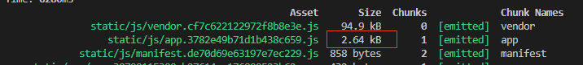

> 我们知道，组件是```Vue```体系的核心，熟练使用组件是掌握```Vue```进行开发的基础。上一节中，我们深入了解了```Vue```组件注册到使用渲染的完整流程。这一节我们会在上一节的基础上介绍组件的两个高级用法：异步组件和函数式组件。

## 6.1 异步组件
### 6.1.1 使用场景
`Vue`作为单页面应用遇到最棘手的问题是首屏加载时间的问题，单页面应用会把页面脚本打包成一个文件，这个文件包含着所有业务和非业务的代码，而脚本文件过大也是造成首页渲染速度缓慢的原因。因此作为首屏性能优化的课题，最常用的处理方法是对文件的拆分和代码的分离。按需加载的概念也是在这个前提下引入的。我们往往会把一些非首屏的组件设计成异步组件，部分不影响初次视觉体验的组件也可以设计为异步组件。这个思想就是**按需加载**。通俗点理解，按需加载的思想让应用在需要使用某个组件时才去请求加载组件代码。我们借助```webpack```打包后的结果会更加直观。





`webpack`遇到异步组件，会将其从主脚本中分离，减少脚本体积，加快首屏加载时间。当遇到场景需要使用该组件时，才会去加载组件脚本。


### 6.1.2 工厂函数

`Vue`中允许用户通过工厂函数的形式定义组件，这个工厂函数会异步解析组件定义，组件需要渲染的时候才会触发该工厂函数，加载结果会进行缓存，以供下一次调用组件时使用。
具体使用：
```js
// 全局注册：
Vue.component('asyncComponent', function(resolve, reject) {
  require(['./test.vue'], resolve)
})
// 局部注册：
var vm = new Vue({
  el: '#app',
  template: '<div id="app"><asyncComponent></asyncComponent></div>',
  components: {
    asyncComponent: (resolve, reject) => require(['./test.vue'], resolve),
    // 另外写法
    asyncComponent: () => import('./test.vue'),
  }
})
```


### 6.1.3 流程分析

有了上一节组件注册的基础，我们来分析异步组件的实现逻辑。简单回忆一下上一节的流程，实例的挂载流程分为根据渲染函数创建```Vnode```和根据```Vnode```产生真实节点的过程。期间创建```Vnode```过程，如果遇到子的占位符节点会调用```creatComponent```,这里会为子组件做选项合并和钩子挂载的操作，并创建一个以```vue-component-```为标记的子```Vnode```,而异步组件的处理逻辑也是在这个阶段处理。

```js
// 创建子组件过程
  function createComponent (
    Ctor, // 子类构造器
    data,
    context, // vm实例
    children, // 子节点
    tag // 子组件占位符
  ) {
    ···
    // 针对局部注册组件创建子类构造器
    if (isObject(Ctor)) {
      Ctor = baseCtor.extend(Ctor);
    }
    // 异步组件分支
    var asyncFactory;
    if (isUndef(Ctor.cid)) {
      // 异步工厂函数
      asyncFactory = Ctor;
      // 创建异步组件函数
      Ctor = resolveAsyncComponent(asyncFactory, baseCtor);
      if (Ctor === undefined) {
        return createAsyncPlaceholder(
          asyncFactory,
          data,
          context,
          children,
          tag
        )
      }
    }
    ···
    // 创建子组件vnode
    var vnode = new VNode(
      ("vue-component-" + (Ctor.cid) + (name ? ("-" + name) : '')),
      data, undefined, undefined, undefined, context,
      { Ctor: Ctor, propsData: propsData, listeners: listeners, tag: tag, children: children },
      asyncFactory
    );

    return vnode
  }
```
**工厂函数的用法使得```Vue.component(name, options)```的第二个参数不是一个对象，因此不论是全局注册还是局部注册，都不会执行```Vue.extend```生成一个子组件的构造器，**所以```Ctor.cid```不会存在，代码会进入异步组件的分支。

异步组件分支的核心是```resolveAsyncComponent```,它的处理逻辑分支众多，我们先关心工厂函数处理部分。
```js
function resolveAsyncComponent (
    factory,
    baseCtor
  ) {
    if (!isDef(factory.owners)) {

      // 异步请求成功处理
      var resolve = function() {}
      // 异步请求失败处理
      var reject = function() {}

      // 创建子组件时会先执行工厂函数，并将resolve和reject传入
      var res = factory(resolve, reject);

      // resolved 同步返回
      return factory.loading
        ? factory.loadingComp
        : factory.resolved
    }
  }
```
如果经常使用```promise```进行开发，我们很容易发现，这部分代码像极了```promsie```原理内部的实现，针对异步组件工厂函数的写法，大致可以总结出以下三个步骤：
1. 定义异步请求成功的函数处理，定义异步请求失败的函数处理；
2. 执行组件定义的工厂函数；
3. 同步返回请求成功的函数处理。

`resolve, reject`的实现，都是```once```方法执行的结果，所以我们先关注一下高级函数```once```的原理。**为了防止当多个地方调用异步组件时，```resolve,reject```不会重复执行，```once```函数保证了函数在代码只执行一次。也就是说，```once```缓存了已经请求过的异步组件**

```js
// once函数保证了这个调用函数只在系统中调用一次
function once (fn) {
  // 利用闭包特性将called作为标志位
  var called = false;
  return function () {
    // 调用过则不再调用
    if (!called) {
      called = true;
      fn.apply(this, arguments);
    }
  }
}
```

成功```resolve```和失败```reject```的详细处理逻辑如下： 
```js
// 成功处理
var resolve = once(function (res) {
  // 转成组件构造器，并将其缓存到resolved属性中。
  factory.resolved = ensureCtor(res, baseCtor);
  if (!sync) {
    //强制更新渲染视图
    forceRender(true);
  } else {
    owners.length = 0;
  }
});
// 失败处理
var reject = once(function (reason) {
  warn(
    "Failed to resolve async component: " + (String(factory)) +
    (reason ? ("\nReason: " + reason) : '')
  );
  if (isDef(factory.errorComp)) {
    factory.error = true;
    forceRender(true);
  }
});
```
异步组件加载完毕，会调用```resolve```定义的方法，方法会通过```ensureCtor```将加载完成的组件转换为组件构造器，并存储在```resolved```属性中，其中 ```ensureCtor```的定义为：
```js
function ensureCtor (comp, base) {
    if (comp.__esModule ||(hasSymbol && comp[Symbol.toStringTag] === 'Module')) {
      comp = comp.default;
    }
    // comp结果为对象时，调用extend方法创建一个子类构造器
    return isObject(comp)
      ? base.extend(comp)
      : comp
  }
```
组件构造器创建完毕，会进行一次视图的重新渲染，**由于```Vue```是数据驱动视图渲染的，而组件在加载到完毕的过程中，并没有数据发生变化，因此需要手动强制更新视图。**```forceRender```函数的内部会拿到每个调用异步组件的实例，执行原型上的```$forceUpdate```方法，这部分的知识等到响应式系统时介绍。

异步组件加载失败后，会调用```reject```定义的方法，方法会提示并标记错误，最后同样会强制更新视图。


回到异步组件创建的流程，执行异步过程会同步为加载中的异步组件创建一个注释节点```Vnode```
```js
  function createComponent (){
    ···
    // 创建异步组件函数
    Ctor = resolveAsyncComponent(asyncFactory, baseCtor);
    if (Ctor === undefined) {
      // 创建注释节点
      return createAsyncPlaceholder(asyncFactory,data,context,children,tag)
    }
  }
```
`createAsyncPlaceholder`的定义也很简单,其中```createEmptyVNode```之前有介绍过，是创建一个注释节点```vnode```，而```asyncFactory,asyncMeta```都是用来标注该节点为异步组件的临时节点和相关属性。
```js
// 创建注释Vnode
function createAsyncPlaceholder (factory,data,context,children,tag) {
  var node = createEmptyVNode();
  node.asyncFactory = factory;
  node.asyncMeta = { data: data, context: context, children: children, tag: tag };
  return node
}
```
执行```forceRender```触发组件的重新渲染过程时，又会再次调用```resolveAsyncComponent```,这时返回值```Ctor```不再为 ```undefined```了，因此会正常走组件的```render,patch```过程。这时，旧的注释节点也会被取代。

### 6.1.4 Promise异步组件
异步组件的第二种写法是在工厂函数中返回一个```promise```对象，我们知道```import```是```es6```引入模块加载的用法，但是```import```是一个静态加载的方法，它会优先模块内的其他语句执行。因此引入了```import()```,```import()```是一个运行时加载模块的方法，可以用来类比```require()```方法，区别在于前者是一个异步方法，后者是同步的，且```import()```会返回一个```promise```对象。


具体用法：
```js
Vue.component('asyncComponent', () => import('./test.vue'))
```
源码依然走着异步组件处理分支，并且大部分的处理过程还是工厂函数的逻辑处理，区别在于执行异步函数后会返回一个```promise```对象，成功加载则执行```resolve```,失败加载则执行```reject```.
```js
var res = factory(resolve, reject);
// res是返回的promise
if (isObject(res)) {
  if (isPromise(res)) {
    if (isUndef(factory.resolved)) {
      // 核心处理
      res.then(resolve, reject);
    }
  }
}
```
其中```promise```对象的判断最简单的是判断是否有```then```和```catch```方法：
```js
 // 判断promise对象的方法
  function isPromise (val) {
    return (isDef(val) && typeof val.then === 'function' && typeof val.catch === 'function')
  }
```

### 6.1.5 高级异步组件
为了在操作上更加灵活，比如使用```loading```组件处理组件加载时间过长的等待问题，使用```error```组件处理加载组件失败的错误提示等，```Vue```在2.3.0+版本新增了返回对象形式的异步组件格式，对象中可以定义需要加载的组件```component```,加载中显示的组件```loading```,加载失败的组件```error```,以及各种延时超时设置，源码同样进入异步组件分支。
```js
Vue.component('asyncComponent', () => ({
  // 需要加载的组件 (应该是一个 `Promise` 对象)
  component: import('./MyComponent.vue'),
  // 异步组件加载时使用的组件
  loading: LoadingComponent,
  // 加载失败时使用的组件
  error: ErrorComponent,
  // 展示加载时组件的延时时间。默认值是 200 (毫秒)
  delay: 200,
  // 如果提供了超时时间且组件加载也超时了，
  // 则使用加载失败时使用的组件。默认值是：`Infinity`
  timeout: 3000
}))
```
异步组件函数执行后返回一个对象，并且对象的```component```执行会返回一个```promise```对象，因此进入高级异步组件处理分支。
```js
if (isObject(res)) {
  if (isPromise(res)) {}
  // 返回对象，且res.component返回一个promise对象，进入分支
  // 高级异步组件处理分支
  else if (isPromise(res.component)) {
    // 和promise异步组件处理方式相同
    res.component.then(resolve, reject);
    ···
  }
}
```
异步组件会等待响应成功失败的结果，与此同时，代码继续同步执行。高级选项设置中如果设置了```error```和```loading```组件，会同时创建两个子类的构造器,
```js
if (isDef(res.error)) {
  // 异步错误时组件的处理，创建错误组件的子类构造器，并赋值给errorComp
  factory.errorComp = ensureCtor(res.error, baseCtor);
}

if (isDef(res.loading)) {
  // 异步加载时组件的处理，创建错误组件的子类构造器，并赋值给errorComp
  factory.loadingComp = ensureCtor(res.loading, baseCtor);
}
```
如果存在```delay```属性,则通过```settimeout```设置```loading```组件显示的延迟时间。```factory.loading```属性用来标注是否是显示```loading```组件。
```js
if (res.delay === 0) {
  factory.loading = true;
} else {
  // 超过时间会成功加载，则执行失败结果
  setTimeout(function () {
    if (isUndef(factory.resolved) && isUndef(factory.error)) {
      factory.loading = true;
      forceRender(false);
    }
  }, res.delay || 200);
}
```
如果在```timeout```时间内，异步组件还未执行```resolve```的成功结果，即```resolve```没有赋值,则进行```reject```失败处理。

接下来依然是渲染注释节点或者渲染```loading```组件，等待异步处理结果，根据处理结果重新渲染视图节点，相似过程不再阐述。

### 6.1.6 wepack异步组件用法
`webpack`作为```Vue```应用构建工具的标配，我们需要知道```Vue```如何结合```webpack ```进行异步组件的代码分离，并且需要关注分离后的文件名，这个名字在```webpack```中称为```chunkName```。```webpack```为异步组件的加载提供了两种写法。
- `require.ensure`:它是```webpack```传统提供给异步组件的写法，在编译时，```webpack```会静态地解析代码中的 ```require.ensure()```，同时将模块添加到一个分开的 ```chunk``` 中，其中函数的第三个参数为分离代码块的名字。修改后的代码写法如下：

```js
Vue.component('asyncComponent', function (resolve, reject) {
   require.ensure([], function () {
     resolve(require('./test.vue'));
   }, 'asyncComponent'); // asyncComponent为chunkname
})
``` 

- `import(/* webpackChunkName: "asyncComponent" */, component)`: 有了```es6```,```import```的写法是现今官方最推荐的做法，其中通过注释```webpackChunkName```来指定分离后组件模块的命名。修改后的写法如下：

```js
Vue.component('asyncComponent', () => import(/* webpackChunkName: "asyncComponent" */, './test.vue'))
```

至此，我们已经掌握了所有异步组件的写法，并深入了解了其内部的实现细节。我相信全面的掌握异步组件对今后单页面性能优化方面会起到积极的指导作用。

## 6.2 函数式组件
`Vue`提供了一种可以让组件变为无状态、无实例的函数化组件。从原理上说，一般子组件都会经过实例化的过程，而单纯的函数组件并没有这个过程，它可以简单理解为一个中间层，只处理数据，不创建实例，也是由于这个行为，它的渲染开销会低很多。实际的应用场景是，当我们需要在多个组件中选择一个来代为渲染，或者在将```children,props,data```等数据传递给子组件前进行数据处理时，我们都可以用函数式组件来完成，它本质上也是对组件的一个外部包装。

### 6.2.1 使用场景

- 定义两个组件对象，```test1，test2```
```js
var test1 = {
  props: ['msg'],
  render: function (createElement, context) {
    return createElement('h1', this.msg)
  }
}
var test2 = {
  props: ['msg'],
  render: function (createElement, context) {
    return createElement('h2', this.msg)
  }
}
```
- 定义一个函数式组件，它会根据计算结果选择其中一个组件进行选项
```js
Vue.component('test3', {
  // 函数式组件的标志 functional设置为true
  functional: true,
  props: ['msg'],
  render: function (createElement, context) {
    var get = function() {
      return test1
    }
    return createElement(get(), context)
  }
})
```
- 函数式组件的使用
```js
<test3 :msg="msg" id="test">
</test3>
new Vue({
  el: '#app',
  data: {
    msg: 'test'
  }
})
```
- 最终渲染的结果为：
```js
<h2>test</h2>
```

### 6.2.2 源码分析
函数式组件会在组件的对象定义中，将```functional```属性设置为```true```，这个属性是区别普通组件和函数式组件的关键。同样的在遇到子组件占位符时，会进入```createComponent```进行子组件```Vnode```的创建。**由于```functional```属性的存在，代码会进入函数式组件的分支中，并返回```createFunctionalComponent```调用的结果。**注意，执行完```createFunctionalComponent```后，后续创建子```Vnode```的逻辑不会执行，这也是之后在创建真实节点过程中不会有子```Vnode```去实例化子组件的原因。(无实例)
```js
function createComponent(){
  ···
  if (isTrue(Ctor.options.functional)) {
    return createFunctionalComponent(Ctor, propsData, data, context, children)
  }
}
```
`createFunctionalComponent`方法会对传入的数据进行检测和合并，实例化```FunctionalRenderContext```，最终调用函数式组件自定义的```render```方法执行渲染过程。
```js
function createFunctionalComponent(
  Ctor, // 函数式组件构造器
  propsData, // 传入组件的props
  data, // 占位符组件传入的attr属性
  context, // vue实例
  children// 子节点
){
  // 数据检测合并
  var options = Ctor.options;
  var props = {};
  var propOptions = options.props;
  if (isDef(propOptions)) {
    for (var key in propOptions) {
      props[key] = validateProp(key, propOptions, propsData || emptyObject);
    }
  } else {
    // 合并attrs
    if (isDef(data.attrs)) { mergeProps(props, data.attrs); }
    // 合并props
    if (isDef(data.props)) { mergeProps(props, data.props); }
  }
  var renderContext = new FunctionalRenderContext(data,props,children,contextVm,Ctor);
  // 调用函数式组件中自定的render函数
  var vnode = options.render.call(null, renderContext._c, renderContext)
}
```
而```FunctionalRenderContext```这个类最终的目的是定义一个和真实组件渲染不同的```render```方法。
```js
function FunctionalRenderContext() {
  // 省略其他逻辑
  this._c = function (a, b, c, d) { return createElement(contextVm, a, b, c, d, needNormalization); };
}
```
执行```render```函数的过程，又会递归调用```createElement```的方法，这时的组件已经是真实的组件，开始执行正常的组件挂载流程。

问题：为什么函数式组件需要定义一个不同的```createElement```方法？- 函数式组件```createElement```和以往唯一的不同是，最后一个参数的不同，之前章节有说到，```createElement```会根据最后一个参数决定是否对子```Vnode```进行拍平，一般情况下，```children```编译生成结果都是```Vnode```类型，只有函数式组件比较特殊，它可以返回一个数组，这时候拍平就是有必要的。我们看下面的例子：
```js
Vue.component('test', {  
  functional: true,  
  render: function (createElement, context) {  
    return context.slots().default  
  }  
}) 

<test> 
     <p>slot1</p> 
     <p>slot</p> 
</test>
```
此时函数式组件```test```的```render```函数返回的是两个```slot```的```Vnode```，它是以数组的形式存在的,这就是需要拍平的场景。

简单总结一下函数式组件，从源码中可以看出，函数式组件并不会像普通组件那样有实例化组件的过程，因此包括组件的生命周期，组件的数据管理这些过程都没有，它只会原封不动的接收传递给组件的数据做处理，并渲染需要的内容。因此作为纯粹的函数可以也大大降低渲染的开销。


## 6.3 小结
这一小节在组件基础之上介绍了两个进阶的用法，异步组件和函数式组件。它们都是为了解决某些类型场景引入的高级组件用法。其中异步组件是首屏性能优化的一个解决方案，并且```Vue```提供了多达三种的使用方法，高级配置的用法更让异步组件的使用更加灵活。当然大部分情况下，我们会结合```webpack```进行使用。另外，函数式组件在多组件中选择渲染内容的场景作用非凡，由于是一个无实例的组件，它在渲染开销上比普通组件的性能更好。
