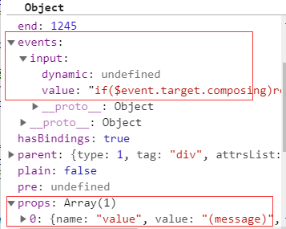

> 双向数据绑定这个概念或者大家并不陌生，视图影响数据，数据同样影响视图，两者间有双向依赖的关系。在响应式系统构建的上，中，下篇我已经对数据影响视图的原理详细阐述清楚了。而如何完成视图影响数据这一关联？这就是本节讨论的重点：指令```v-model```。

由于```v-model```和前面介绍的插槽，事件一致，都属于vue提供的指令，所以我们对```v-model```的分析方式和以往大同小异。分析会围绕模板的编译，```render```函数的生成，到最后真实节点的挂载顺序执行。最终我们依然会得到一个结论，**v-model无论什么使用场景，本质上都是一个语法糖**。


## 11.1 表单绑定
### 11.1.1 基础使用
`v-model`和表单脱离不了关系，之所以视图能影响数据，本质上这个视图需要可交互的，因此表单是实现这一交互的前提。表单的使用以```<input > <textarea> <select>```为核心，更细的划分结合```v-model```的使用如下：
```html
// 普通输入框
<input type="text" v-model="value1">

// 多行文本框
<textarea v-model="value2" cols="30" rows="10"></textarea>

// 单选框
<div class="group">
  <input type="radio" value="one" v-model="value3"> one
  <input type="radio" value="two" v-model="value3"> two
</div> 

// 原生单选框的写法 注：原生单选框的写法需要通过name绑定一组单选，两个radio的name属性相同，才能表现为互斥
<div class="group">
  <input type="radio" name="number" value="one">one
  <input type="radio" name="number" value="two">two
</div>


// 多选框  (原始值： value4: [])
<div class="group">
  <input type="checkbox" value="jack" v-model="value4">jack
  <input type="checkbox" value="lili" v-model="value4">lili
</div>

// 下拉选项
<select name="" id="" v-model="value5">
  <option value="apple">apple</option>
  <option value="banana">banana</option>
  <option value="bear">bear</option>
</select>

```
接下来的分析，我们以普通输入框为例
```js
<div id="app">
  <input type="text" v-model="value1">
</div>

new Vue({
  el: '#app',
  data() {
    return {
      value1: ''
    }
  }
})
```
进入正文前先回顾一下模板到真实节点的过程。
1. 模板解析成```AST```树;
2. ```AST```树生成可执行的```render```函数;
3. ```render```函数转换为```Vnode```对象;
4. 根据```Vnode```对象生成真实的```Dom```节点。

接下来，我们先看看模板解析为```AST```树的过程。

### 11.1.2 AST树的解析
模板的编译阶段，会调用```var ast = parse(template.trim(), options)```生成```AST```树，```parse```函数的其他细节这里不展开分析，前面的文章或多或少都涉及过，我们还是把关注点放在模板属性上的解析，也就是```processAttrs```函数上。

使用过```vue```写模板的都知道，```vue```模板属性由两部分组成，一部分是指令，另一部分是普通```html```标签属性。z这也是属性处理的两大分支。而在指令的细分领域，又将```v-on，v-bind```做特殊的处理，其他的普通分支会执行```addDirective```过程。
```js
// 处理模板属性
function processAttrs(el) {
  var list = el.attrsList;
  var i, l, name, rawName, value, modifiers, syncGen, isDynamic;
  for (i = 0, l = list.length; i < l; i++) {
    name = rawName = list[i].name; // v-on:click
    value = list[i].value; // doThis
    if (dirRE.test(name)) { // 1.针对指令的属性处理
      ···
      if (bindRE.test(name)) { // v-bind分支
        ···
      } else if(onRE.test(name)) { // v-on分支
        ···
      } else { // 除了v-bind，v-on之外的普通指令
        ···
        // 普通指令会在AST树上添加directives属性
        addDirective(el, name, rawName, value, arg, isDynamic, modifiers, list[i]);
        if (name === 'model') {
          checkForAliasModel(el, value);
        }
      }
    } else {
      // 2. 普通html标签属性
    }

  }
}
```
在揭秘事件机制这一节，我们介绍了```AST```产生阶段对事件指令```v-on```的处理是为```AST```树添加```events```属性。类似的，普通指令会在```AST```树上添加```directives```属性，具体看```addDirective```函数。

```js
// 添加directives属性
function addDirective (el,name,rawName,value,arg,isDynamicArg,modifiers,range) {
    (el.directives || (el.directives = [])).push(rangeSetItem({
      name: name,
      rawName: rawName,
      value: value,
      arg: arg,
      isDynamicArg: isDynamicArg,
      modifiers: modifiers
    }, range));
    el.plain = false;
  }
```
最终```AST```树多了一个属性对象，其中```modifiers```代表模板中添加的修饰符，如：```.lazy, .number, .trim```。
```js
// AST
{
  directives: {
    {
      rawName: 'v-model',
      value: 'value',
      name: 'v-model',
      modifiers: undefined
    }
  }
}
```
### 11.1.3 render函数生成

`render`函数生成阶段，也就是前面分析了数次的```generate```逻辑，其中```genData```会对模板的诸多属性进行处理,最终返回拼接好的字符串模板，而对指令的处理会进入```genDirectives```流程。
```js
function genData(el, state) {
  var data = '{';
  // 指令的处理
  var dirs = genDirectives(el, state);
  ··· // 其他属性，指令的处理
  // 针对组件的v-model处理，放到后面分析
  if (el.model) {
    data += "model:{value:" + (el.model.value) + ",callback:" + (el.model.callback) + ",expression:" + (el.model.expression) + "},";
  }
  return data
}
```
`genDirectives`逻辑并不复杂,他会拿到之前```AST```树中保留的```directives```对象，并遍历解析指令对象，最终以```'directives:['```包裹的字符串返回。
```js
// directives render字符串的生成
  function genDirectives (el, state) {
    // 拿到指令对象
    var dirs = el.directives;
    if (!dirs) { return }
    // 字符串拼接
    var res = 'directives:[';
    var hasRuntime = false;
    var i, l, dir, needRuntime;
    for (i = 0, l = dirs.length; i < l; i++) {
      dir = dirs[i];
      needRuntime = true;
      // 对指令ast树的重新处理
      var gen = state.directives[dir.name];
      if (gen) {
        // compile-time directive that manipulates AST.
        // returns true if it also needs a runtime counterpart.
        needRuntime = !!gen(el, dir, state.warn);
      }
      if (needRuntime) {
        hasRuntime = true;
        res += "{name:\"" + (dir.name) + "\",rawName:\"" + (dir.rawName) + "\"" + (dir.value ? (",value:(" + (dir.value) + "),expression:" + (JSON.stringify(dir.value))) : '') + (dir.arg ? (",arg:" + (dir.isDynamicArg ? dir.arg : ("\"" + (dir.arg) + "\""))) : '') + (dir.modifiers ? (",modifiers:" + (JSON.stringify(dir.modifiers))) : '') + "},";
      }
    }
    if (hasRuntime) {
      return res.slice(0, -1) + ']'
    }
  }
```
这里有一句关键的代码```var gen = state.directives[dir.name]```,为了了解其来龙去脉，我们回到Vue源码中的编译流程，在以往的文章中，我们完整的介绍过```template```模板的编译流程,这一部分的设计是非常复杂且巧妙的，其中大量运用了偏函数的思想，即分离了不同平台不同的编译过程，也为同一个平台每次提供相同的配置选项进行了合并处理，并很好的将配置进行了缓存。其中针对浏览器端有三个重要的指令选项。
```js
var directive$1 = {
  model: model,
  text: text,
  html, html
}
var baseOptions = {
  ···
  // 指令选项
  directives: directives$1,
};
// 编译时传入选项配置
createCompiler(baseOptions)
```
而这个```state.directives['model']```也就是对应的```model```函数，所以我们先把焦点聚焦在```model```函数的逻辑。
```js
function model (el,dir,_warn) {
    warn$1 = _warn;
    // 绑定的值
    var value = dir.value;
    var modifiers = dir.modifiers;
    var tag = el.tag;
    var type = el.attrsMap.type;
    {
      // 这里遇到type是file的html，如果还使用双向绑定会报出警告。
      // 因为File inputs是只读的
      if (tag === 'input' && type === 'file') {
        warn$1(
          "<" + (el.tag) + " v-model=\"" + value + "\" type=\"file\">:\n" +
          "File inputs are read only. Use a v-on:change listener instead.",
          el.rawAttrsMap['v-model']
        );
      }
    }
    //组件上v-model的处理
    if (el.component) {
      genComponentModel(el, value, modifiers);
      // component v-model doesn't need extra runtime
      return false
    } else if (tag === 'select') {
      // select表单
      genSelect(el, value, modifiers);
    } else if (tag === 'input' && type === 'checkbox') {
      // checkbox表单
      genCheckboxModel(el, value, modifiers);
    } else if (tag === 'input' && type === 'radio') {
      // radio表单
      genRadioModel(el, value, modifiers);
    } else if (tag === 'input' || tag === 'textarea') {
      // 普通input，如 text, textarea
      genDefaultModel(el, value, modifiers);
    } else if (!config.isReservedTag(tag)) {
      genComponentModel(el, value, modifiers);
      // component v-model doesn't need extra runtime
      return false
    } else {
      // 如果不是表单使用v-model，同样会报出警告，双向绑定只针对表单控件。
      warn$1(
        "<" + (el.tag) + " v-model=\"" + value + "\">: " +
        "v-model is not supported on this element type. " +
        'If you are working with contenteditable, it\'s recommended to ' +
        'wrap a library dedicated for that purpose inside a custom component.',
        el.rawAttrsMap['v-model']
      );
    }
    // ensure runtime directive metadata
    // 
    return true
  }
```
显然，**```model```会对表单控件的```AST```树做进一步的处理**，在上面的基础用法中，我们知道**表单有不同的类型，每种类型对应的事件处理响应机制也不同**。因此我们需要针对不同的表单控件生成不同的```render```函数，因此需要产生不同的```AST```属性。```model```针对不同类型的表单控件有不同的处理分支。我们重点分析普通```input```标签的处理，```genDefaultModel```分支，其他类型的分支，可以仿照下面的分析过程。


```js
function genDefaultModel (el,value,modifiers) {
    var type = el.attrsMap.type;

    // v-model和v-bind值相同值，有冲突会报错
    {
      var value$1 = el.attrsMap['v-bind:value'] || el.attrsMap[':value'];
      var typeBinding = el.attrsMap['v-bind:type'] || el.attrsMap[':type'];
      if (value$1 && !typeBinding) {
        var binding = el.attrsMap['v-bind:value'] ? 'v-bind:value' : ':value';
        warn$1(
          binding + "=\"" + value$1 + "\" conflicts with v-model on the same element " +
          'because the latter already expands to a value binding internally',
          el.rawAttrsMap[binding]
        );
      }
    }
    // modifiers存贮的是v-model的修饰符。
    var ref = modifiers || {};
    // lazy,trim,number是可供v-model使用的修饰符
    var lazy = ref.lazy;
    var number = ref.number;
    var trim = ref.trim;
    var needCompositionGuard = !lazy && type !== 'range';
    // lazy修饰符将触发同步的事件从input改为change
    var event = lazy ? 'change' : type === 'range' ? RANGE_TOKEN : 'input';

    var valueExpression = '$event.target.value';
    // 过滤用户输入的首尾空白符
    if (trim) {
      valueExpression = "$event.target.value.trim()";
    }
    // 将用户输入转为数值类型
    if (number) {
      valueExpression = "_n(" + valueExpression + ")";
    }
    // genAssignmentCode函数是为了处理v-model的格式，允许使用以下的形式： v-model="a.b" v-model="a[b]"
    var code = genAssignmentCode(value, valueExpression);
    if (needCompositionGuard) {
      //  保证了不会在输入法组合文字过程中得到更新
      code = "if($event.target.composing)return;" + code;
    }
    //  添加value属性
    addProp(el, 'value', ("(" + value + ")"));
    // 绑定事件
    addHandler(el, event, code, null, true);
    if (trim || number) {
      addHandler(el, 'blur', '$forceUpdate()');
    }
  }

function genAssignmentCode (value,assignment) {
  // 处理v-model的格式，v-model="a.b" v-model="a[b]"
  var res = parseModel(value);
  if (res.key === null) {
    // 普通情形
    return (value + "=" + assignment)
  } else {
    // 对象形式
    return ("$set(" + (res.exp) + ", " + (res.key) + ", " + assignment + ")")
  }
}
```
`genDefaultModel`的逻辑有两部分，**一部分是针对修饰符产生不同的事件处理字符串，二是为```v-model```产生的```AST```树添加属性和事件相关的属性**。其中最重要的两行代码是
```js
//  添加value属性
addProp(el, 'value', ("(" + value + ")"));
// 绑定事件属性
addHandler(el, event, code, null, true);
```
`addHandler`在之前介绍事件时分析过，他会为```AST```树添加事件相关的属性,同样的```addProp```也会为```AST```树添加```props```属性。最终```AST```树新增了两个属性：




回到```genData```,通过```genDirectives```处理后，原先的```AST```树新增了两个属性，因此在字符串生成阶段同样需要处理```props```和```events```的分支。
```js
function genData$2 (el, state) {
  var data = '{';
  // 已经分析过的genDirectives
  var dirs = genDirectives(el, state);
  // 处理props
  if (el.props) {
    data += "domProps:" + (genProps(el.props)) + ",";
  }
  // 处理事件
  if (el.events) {
    data += (genHandlers(el.events, false)) + ",";
  }
}
```
最终```render```函数的结果为：

```js
"_c('input',{directives:[{name:"model",rawName:"v-model",value:(message),expression:"message"}],attrs:{"type":"text"},domProps:{"value":(message)},on:{"input":function($event){if($event.target.composing)return;message=$event.target.value}}})"

```

```js
<input type="text" v-model="value">
```

如果觉得上面的流程分析啰嗦，可以直接看下面的结论，对比模板和生成的```render```函数,我们可以得到：

1. `input`标签所有属性，包括指令相关的内容都是以```data```属性的形式作为参数的整体传入```_c(即：createElement)```函数。
2. `input type`的类型，在```data```属性中，以```attrs```键值对存在。
3. `v-model`会有对应的```directives```属性描述指令的相关信息。
4. **为什么说```v-model```是一个语法糖，从```render```函数的最终结果可以看出，它最终以两部分形式存在于```input```标签中，一个是将```value1```以```props```的形式存在(```domProps```)中，另一个是以事件的形式存储```input```事件，并保留在```on```属性中。**
5. 重要的一个关键，事件用```$event.target.composing```属性来保证不会在输入法组合文字过程中更新数据,这点我们后面会再次提到。


### 11.1.4 patch真实节点

在```patch```之前还有一个生成```vnode```的过程，这个过程没有什么特别之处，所有的包括指令，属性会以```data```属性的形式传递到构造函数```Vnode```中，最终的```Vnode```拥有```directives,domProps,on```属性：


有了```Vnode```之后紧接着会执行```patchVnode```,```patchVnode```过程是一个真实节点创建的过程，其中的关键是```createElm```方法，这个方法我们在不同的场合也分析过，前面的源码得到指令相关的信息也会保留在```vnode```的```data```属性里，所以对属性的处理也会走```invokeCreateHooks```逻辑。

```js
function createElm() {
  ···
  // 针对指令的处理
   if (isDef(data)) {
      invokeCreateHooks(vnode, insertedVnodeQueue);
    }
}
```
`invokeCreateHooks`会调用定义好的钩子函数，对```vnode```上定义的属性，指令，事件等进行真实DOM的处理，步骤包括以下(不包含全部)：
1. `updateDOMProps`会利用```vnode data```上的```domProps```更新```input```标签的```value```值;
2. `updateAttrs`会利用```vnode data```上的```attrs```属性更新节点的属性值;
3. `updateDomListeners`利用```vnode data```上的```on```属性添加事件监听。

**因此```v-model```语法糖最终反应的结果，是通过监听表单控件自身的```input```事件(其他类型有不同的监听事件类型)，去影响自身的```value```值**。如果没有```v-model```的语法糖，我们可以这样写：
`<input type="text" :value="message" @input="(e) => { this.message = e.target.value }" >`


### 11.1.5 语法糖的背后

**然而```v-model```仅仅是起到合并语法，创建一个新的语法糖的意义吗？**
**显然答案是否定的，对于需要使用输入法 (如中文、日文、韩文等) 的语言，你会发现 ```v-model``` 不会在输入法组合文字过程中得到更新。**这就是```v-model```的一个重要的特点。它会在事件处理这一层添加新的事件监听```compositionstart,compositionend```，他们会分别在语言输入的开始和结束时监听到变化，只要借助```$event.target.composing```，就可以设计出只会在输入法组合文字的结束阶段才更新数据，这有利于提高用户的使用体验。这一部分我想借助脱离框架的表单来帮助理解。


脱离框架的一个视图响应数据的实现（效果类似于v-model）：
```js
// html
<input type="text" id="inputValue">
<span id="showValue"></span>

// js

<script>
    let input = document.getElementById('inputValue');
    let show = document.getElementById('showValue');
    input.value = 123;
    show.innerText = input.value

    function onCompositionStart(e) {
      e.target.composing = true;
    }

    function onCompositionEnd(e) {
      if (!e.target.composing) {
        return
      }
      e.target.composing = false;
      show.innerText = e.target.value
    }
    function onInputChange(e) {
      // e.target.composing表示是否还在输入中
      if(e.target.composing)return;
      show.innerText = e.target.value
    }
    input.addEventListener('input', onInputChange)
    input.addEventListener('compositionstart', onCompositionStart)// 组合输入开始
    input.addEventListener('compositionend', onCompositionEnd) // 组合输入结束
</script>
```


## 11.2 组件使用v-model
最后我们简单说说在父组件中使用```v-model```,可以先看结论，**组件上使用```v-model```本质上是子父组件通信的语法糖**。先看一个简单的使用例子。

```js
 var child = {
    template: '<div><input type="text" :value="value" @input="emitEvent">{{value}}</div>',
    methods: {
      emitEvent(e) {
        this.$emit('input', e.target.value)
      }
    },
    props: ['value']
  }
 new Vue({
   data() {
     return {
       message: 'test'
     }
   },
   components: {
     child
   },
   template: '<div id="app"><child v-model="message"></child></div>',
   el: '#app'
 })
```
父组件上使用```v-model```, 子组件默认会利用名为 ```value``` 的 ```prop``` 和名为 ```input``` 的事件，当然像```select```表单会以其他默认事件的形式存在。分析源码的过程也大致类似，这里只列举几个特别的地方。

`AST`生成阶段和普通表单控件的区别在于，当遇到```child```时，由于不是普通的```html```标签，会执行```getComponentModel```的过程,而```getComponentModel```的结果是在```AST```树上添加```model```的属性。
```js
function model() {
  if (!config.isReservedTag(tag)) {
    genComponentModel(el, value, modifiers);
  }
}

function genComponentModel (el,value,modifiers) {
    var ref = modifiers || {};
    var number = ref.number;
    var trim = ref.trim;

    var baseValueExpression = '$$v';
    var valueExpression = baseValueExpression;
    if (trim) {
      valueExpression =
        "(typeof " + baseValueExpression + " === 'string'" +
        "? " + baseValueExpression + ".trim()" +
        ": " + baseValueExpression + ")";
    }
    if (number) {
      valueExpression = "_n(" + valueExpression + ")";
    }
    var assignment = genAssignmentCode(value, valueExpression);
    // 在ast树上添加model属性，其中有value，expression，callback属性
    el.model = {
      value: ("(" + value + ")"),
      expression: JSON.stringify(value),
      callback: ("function (" + baseValueExpression + ") {" + assignment + "}")
    };
  }
```
最终```AST```树的结果：
```js
{
  model: {
    callback: "function ($$v) {message=$$v}"
    expression: ""message""
    value: "(message)"
  }
}
```
经过对```AST```树的处理后，回到```genData$2```的流程，由于有了```model```属性，父组件拼接的字符串会做进一步处理。
```js
function genData$2 (el, state) { 
  var data = '{';
  var dirs = genDirectives(el, state);
  ···
  // v-model组件的render函数处理
  if (el.model) {
    data += "model:{value:" + (el.model.value) + ",callback:" + (el.model.callback) + ",expression:" + (el.model.expression) + "},";
  }
  ···
  return data
}
```
因此，父组件最终的```render```函数表现为：
```js
"_c('child',{model:{value:(message),callback:function ($$v) {message=$$v},expression:"message"}})"
```

子组件的创建阶段照例会执行```createComponent ```，其中针对```model```的逻辑需要特别说明。

```js
function createComponent() {
  // transform component v-model data into props & events
  if (isDef(data.model)) {
    // 处理父组件的v-model指令对象
    transformModel(Ctor.options, data);
  }
}
```

```js
function transformModel (options, data) {
  // prop默认取的是value，除非配置上有model的选项
  var prop = (options.model && options.model.prop) || 'value';

  // event默认取的是input，除非配置上有model的选项
  var event = (options.model && options.model.event) || 'input'
  // vnode上新增props的属性，值为value
  ;(data.attrs || (data.attrs = {}))[prop] = data.model.value;

  // vnode上新增on属性，标记事件
  var on = data.on || (data.on = {});
  var existing = on[event];
  var callback = data.model.callback;
  if (isDef(existing)) {
    if (
      Array.isArray(existing)
        ? existing.indexOf(callback) === -1
        : existing !== callback
    ) {
      on[event] = [callback].concat(existing);
    }
  } else {
    on[event] = callback;
  }
}
```

从```transformModel```的逻辑可以看出，子组件```vnode```会为```data.props``` 添加 ```data.model.value```，并且给```data.on``` 添加```data.model.callback```。因此父组件```v-model```语法糖本质上可以修改为
```'<child :value="message" @input="function(e){message = e}"></child>' ```


**显然，这种写法就是事件通信的写法，这个过程又回到对事件指令的分析过程了。因此我们可以很明显的意识到，组件使用```v-model```本质上还是一个子父组件通信的语法糖。**
