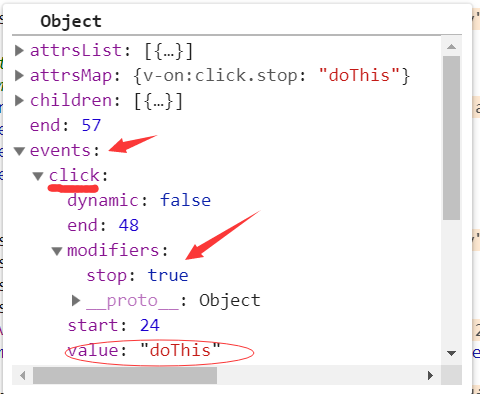
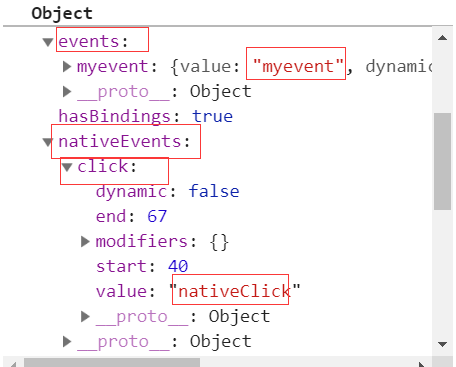

> 这个系列讲到这里，Vue基本核心的东西已经分析完，但是Vue之所以强大，离不开它提供给用户的一些实用功能，开发者可以更偏向于业务逻辑而非基本功能的实现。例如，在日常开发中，我们将```@click=***```用得飞起，但是我们是否思考，Vue如何在后面为我们的模板做事件相关的处理，并且我们经常利用组件的自定义事件去实现父子间的通信，那这个事件和和原生dom事件又有不同的地方吗，能够实现通信的原理又是什么，带着疑惑，我们深入源码展开分析。

## 9.1. 模板编译

`Vue`在挂载实例前，有相当多的工作是进行模板的编译，将```template```模板进行编译，解析成```AST```树，再转换成```render```函数，而有了```render```函数后才会进入实例挂载过程。对于事件而言，我们经常使用```v-on```或者```@```在模板上绑定事件。因此对事件的第一步处理，就是在编译阶段对事件指令做收集处理。

从一个简单的用法分析编译阶段收集的信息：
```html
<div id="app">
    <div v-on:click.stop="doThis">点击</div>
    <span>{{count}}</span>
</div>
```
```js

<script>
var vm = new Vue({
    el: '#app',
    data() {
        return {
            count: 1
        }
    },
    methods: {
        doThis() {
            ++this.count
        }
    }
})
</script>
```

我们之前在将模板编译的时候大致说过编译的流程，模板编译的入口是在```var ast = parse(template.trim(), options);```中，```parse```通过拆分模板字符串，将其解析为一个```AST```树，其中对于属性的处理，在```processAttr```中,由于分支较多，我们只分析例子中的流程。

```js
var dirRE = /^v-|^@|^:/;

function processAttrs (el) {
    var list = el.attrsList;
    var i, l, name, rawName, value, modifiers, syncGen, isDynamic;
    for (i = 0, l = list.length; i < l; i++) {
      name = rawName = list[i].name; // v-on:click
      value = list[i].value; // doThis
      if (dirRE.test(name)) { // 匹配v-或者@开头的指令
        el.hasBindings = true;
        modifiers = parseModifiers(name.replace(dirRE, ''));// parseModifiers('on:click')
        if (modifiers) {
          name = name.replace(modifierRE, '');
        }
        if (bindRE.test(name)) { // v-bind分支
          // ...留到v-bind指令时分析
        } else if (onRE.test(name)) { // v-on分支
          name = name.replace(onRE, ''); // 拿到真正的事件click
          isDynamic = dynamicArgRE.test(name);// 动态事件绑定
          if (isDynamic) {
            name = name.slice(1, -1);
          }
          addHandler(el, name, value, modifiers, false, warn$2, list[i], isDynamic);
        } else { // normal directives
         // 其他指令相关逻辑
      } else {}
    }
  }
```

`processAttrs`的逻辑虽然较多，但是理解起来较为简单，```var dirRE = /^v-|^@|^:/;```是匹配事件相关的正则，命中匹配的记过会得到事件指令相关内容，包括事件本身，事件回调以及事件修饰符。最终通过```addHandler```方法，为```AST```树添加事件相关的属性。而```addHandler```还有一个重要功能是对事件修饰符进行特殊处理。

```js
// el是当前解析的AST树
function addHandler (el,name,value,modifiers,important,warn,range,dynamic) {
    modifiers = modifiers || emptyObject;
    // passive 和 prevent不能同时使用，可以参照官方文档说明
    if (
      warn &&
      modifiers.prevent && modifiers.passive
    ) {
      warn(
        'passive and prevent can\'t be used together. ' +
        'Passive handler can\'t prevent default event.',
        range
      );
    }
    // 这部分的逻辑会对特殊的修饰符做字符串拼接的处理，以备后续的使用
    if (modifiers.right) {
      if (dynamic) {
        name = "(" + name + ")==='click'?'contextmenu':(" + name + ")";
      } else if (name === 'click') {
        name = 'contextmenu';
        delete modifiers.right;
      }
    } else if (modifiers.middle) {
      if (dynamic) {
        name = "(" + name + ")==='click'?'mouseup':(" + name + ")";
      } else if (name === 'click') {
        name = 'mouseup';
      }
    }
    if (modifiers.capture) {
      delete modifiers.capture;
      name = prependModifierMarker('!', name, dynamic);
    }
    if (modifiers.once) {
      delete modifiers.once;
      name = prependModifierMarker('~', name, dynamic);
    }
    /* istanbul ignore if */
    if (modifiers.passive) {
      delete modifiers.passive;
      name = prependModifierMarker('&', name, dynamic);
    }
    // events 用来记录绑定的事件
    var events;
    if (modifiers.native) {
      delete modifiers.native;
      events = el.nativeEvents || (el.nativeEvents = {});
    } else {
      events = el.events || (el.events = {});
    }

    var newHandler = rangeSetItem({ value: value.trim(), dynamic: dynamic }, range);
    if (modifiers !== emptyObject) {
      newHandler.modifiers = modifiers;
    }

    var handlers = events[name];
    /* istanbul ignore if */
    // 绑定的事件可以多个，回调也可以多个，最终会合并到数组中
    if (Array.isArray(handlers)) {
      important ? handlers.unshift(newHandler) : handlers.push(newHandler);
    } else if (handlers) {
      events[name] = important ? [newHandler, handlers] : [handlers, newHandler];
    } else {
      events[name] = newHandler;
    }
    el.plain = false;
  }
```
修饰符的处理会改变最终字符串的拼接结果，我们看最终转换的```AST```树：



## 9.2. 代码生成

模板编译的最后一步是根据解析完的```AST```树生成对应平台的渲染函数，也就是```render```函数的生成过程, 对应```var code = generate(ast, options);```。
```js
function generate (ast,options) {
    var state = new CodegenState(options);
    var code = ast ? genElement(ast, state) : '_c("div")';
    return {
      render: ("with(this){return " + code + "}"), // with函数
      staticRenderFns: state.staticRenderFns
    }
  }
```
其中核心处理在```genElement```中,```genElement```函数会根据不同指令类型处理不同的分支，对于普通模板的编译会进入```genData```函数中处理，同样分析只针对事件相关的处理，从前面解析出的```AST```树明显看出，```AST```树中多了```events```的属性,```genHandlers```函数会为```event```属性做逻辑处理。
```js
function genData (el, state) {
    var data = '{';

    // directives first.
    // directives may mutate the el's other properties before they are generated.
    var dirs = genDirectives(el, state);
    if (dirs) { data += dirs + ','; }
    //其他处理
    ···

    // event handlers
    if (el.events) {
      data += (genHandlers(el.events, false)) + ",";
    }

    ···

    return data
  }
```
`genHandlers`的逻辑，会遍历解析好的```AST```树，拿到```event```对象属性，并根据属性上的事件对象拼接成字符串。
```js
function genHandlers (events,isNative) {
    var prefix = isNative ? 'nativeOn:' : 'on:';
    var staticHandlers = "";
    var dynamicHandlers = "";
    // 遍历ast树解析好的event对象
    for (var name in events) {
      //genHandler本质上是将事件对象转换成可拼接的字符串
      var handlerCode = genHandler(events[name]);
      if (events[name] && events[name].dynamic) {
        dynamicHandlers += name + "," + handlerCode + ",";
      } else {
        staticHandlers += "\"" + name + "\":" + handlerCode + ",";
      }
    }
    staticHandlers = "{" + (staticHandlers.slice(0, -1)) + "}";
    if (dynamicHandlers) {
      return prefix + "_d(" + staticHandlers + ",[" + (dynamicHandlers.slice(0, -1)) + "])"
    } else {
      return prefix + staticHandlers
    }
  }
// 事件模板书写匹配
var isMethodPath = simplePathRE.test(handler.value); // doThis
var isFunctionExpression = fnExpRE.test(handler.value); // () => {} or function() {}
var isFunctionInvocation = simplePathRE.test(handler.value.replace(fnInvokeRE, '')); // doThis($event)


function genHandler (handler) {
    if (!handler) {
      return 'function(){}'
    }
    // 事件绑定可以多个，多个在解析ast树时会以数组的形式存在，如果有多个则会递归调用getHandler方法返回数组。
    if (Array.isArray(handler)) {
      return ("[" + (handler.map(function (handler) { return genHandler(handler); }).join(',')) + "]")
    }
    // value： doThis 可以有三种方式
    var isMethodPath = simplePathRE.test(handler.value); // doThis
    var isFunctionExpression = fnExpRE.test(handler.value); // () => {} or function() {}
    var isFunctionInvocation = simplePathRE.test(handler.value.replace(fnInvokeRE, '')); // doThis($event)

    // 没有任何修饰符
    if (!handler.modifiers) {
      // 符合函数定义规范，则直接返回调用函数名 doThis
      if (isMethodPath || isFunctionExpression) {
        return handler.value
      }
      // 不符合则通过function函数封装返回
      return ("function($event){" + (isFunctionInvocation ? ("return " + (handler.value)) : handler.value) + "}") // inline statement
    } else {
    // 包含修饰符的场景
    }
  }
```
模板中事件的写法有三种,分别对应上诉上个正则匹配的内容。
1. `<div @click="doThis"></div>`
2. `<div @click="doThis($event)"></div>`
3. `<div @click="()=>{}"></div> <div @click="function(){}"></div>`

上述对事件对象的转换，如果事件不带任何修饰符，并且满足正确的模板写法，则直接返回调用事件名，如果不满足，则有可能是```<div @click="console.log(11)"></div>```的写法，此时会封装到```function($event){}```中。

包含修饰符的场景较多，我们单独列出分析。以上文中的例子说明，```modifiers: { stop: true }```会拿到```stop```对应需要添加的逻辑脚本```'$event.stopPropagation();'```,并将它添加到函数字符串中返回。
```js
function genHandler() {
  // ···
  } else {
    var code = '';
    var genModifierCode = '';
    var keys = [];
    // 遍历modifiers上记录的修饰符
    for (var key in handler.modifiers) {
      if (modifierCode[key]) {
        // 根据修饰符添加对应js的代码
        genModifierCode += modifierCode[key];
        // left/right
        if (keyCodes[key]) {
          keys.push(key);
        }
        // 针对exact的处理
      } else if (key === 'exact') {
        var modifiers = (handler.modifiers);
        genModifierCode += genGuard(
          ['ctrl', 'shift', 'alt', 'meta']
            .filter(function (keyModifier) { return !modifiers[keyModifier]; })
            .map(function (keyModifier) { return ("$event." + keyModifier + "Key"); })
            .join('||')
        );
      } else {
        keys.push(key);
      }
    }
    if (keys.length) {
      code += genKeyFilter(keys);
    }
    // Make sure modifiers like prevent and stop get executed after key filtering
    if (genModifierCode) {
      code += genModifierCode;
    }
    // 根据三种不同的书写模板返回不同的字符串
    var handlerCode = isMethodPath
      ? ("return " + (handler.value) + "($event)")
      : isFunctionExpression
        ? ("return (" + (handler.value) + ")($event)")
        : isFunctionInvocation
          ? ("return " + (handler.value))
          : handler.value;
    return ("function($event){" + code + handlerCode + "}")
  }
}
var modifierCode = {
  stop: '$event.stopPropagation();',
  prevent: '$event.preventDefault();',
  self: genGuard("$event.target !== $event.currentTarget"),
  ctrl: genGuard("!$event.ctrlKey"),
  shift: genGuard("!$event.shiftKey"),
  alt: genGuard("!$event.altKey"),
  meta: genGuard("!$event.metaKey"),
  left: genGuard("'button' in $event && $event.button !== 0"),
  middle: genGuard("'button' in $event && $event.button !== 1"),
  right: genGuard("'button' in $event && $event.button !== 2")
};
```

经过这一转换后，生成```with```封装的```render```函数如下：

```js
"_c('div',{attrs:{"id":"app"}},[_c('div',{on:{"click":function($event){$event.stopPropagation();return doThis($event)}}},[_v("点击")]),_v(" "),_c('span',[_v(_s(count))])])"

```

## 9.3. 事件绑定

前面花了大量的篇幅介绍了模板上的事件标记在构建```AST```树上是怎么处理，并且如何根据构建的```AST```树返回正确的```render```渲染函数，**但是真正事件绑定还是离不开绑定注册事件**。这一个阶段就是发生在组件挂载的阶段。
有了```render```函数，自然可以生成实例挂载需要的```Vnode```树，并且会进行```patchVnode```的环节进行真实节点的构建，如果发现过程已经遗忘，可以回顾以往章节。
`Vnode`树的构建过程和之前介绍的内容没有明显的区别，所以这个过程就不做赘述，最终生成的```vnode```如下：


有了```Vnode```,接下来会遍历子节点递归调用```createElm```为每个子节点创建真实的```DOM```,由于```Vnode```中有```data```属性，在创建真实```DOM```时会进行注册相关钩子的过程，其中一个就是注册事件相关处理。

```js
function createElm() {
  ···
  // 针对指令的处理
   if (isDef(data)) {
      invokeCreateHooks(vnode, insertedVnodeQueue);
    }
}


function invokeCreateHooks (vnode, insertedVnodeQueue) {
  for (var i$1 = 0; i$1 < cbs.create.length; ++i$1) {
    cbs.create[i$1](emptyNode, vnode);
  }
  i = vnode.data.hook; // Reuse variable
  if (isDef(i)) {
    if (isDef(i.create)) { i.create(emptyNode, vnode); }
    if (isDef(i.insert)) { insertedVnodeQueue.push(vnode); }
  }
}

var events = {
  create: updateDOMListeners,
  update: updateDOMListeners
};
```

我们经常会在```template```模板中定义```v-on```事件，```v-bind```动态属性，```v-text```动态指令等，和```v-on```事件指令一样，他们都会在编译阶段和```Vnode```生成阶段创建```data```属性，因此```invokeCreateHooks```就是一个模板指令处理的任务，他分别针对不同的指令为真实阶段创建不同的任务。针对事件，这里会调用```updateDOMListeners```对真实的```DOM```节点注册事件任务。

```js
function updateDOMListeners (oldVnode, vnode) {
  // on是事件指令的标志
  if (isUndef(oldVnode.data.on) && isUndef(vnode.data.on)) {
    return
  }
  // 新旧节点不同的事件绑定解绑
  var on = vnode.data.on || {};
  var oldOn = oldVnode.data.on || {};
  // 拿到需要添加事件的真实DOM节点
  target$1 = vnode.elm;
  // normalizeEvents是对事件兼容性的处理
  normalizeEvents(on);
  updateListeners(on, oldOn, add$1, remove$2, createOnceHandler$1, vnode.context);
  target$1 = undefined;
}
```
其中```normalizeEvents```是针对```v-model```的处理,例如在IE下不支持```change```事件，只能用```input```事件代替。

`updateListeners`的逻辑也很简单，它会遍历```on```事件对新节点事件绑定注册事件，对旧节点移除事件监听，它即要处理原生```DOM```事件的添加和移除，也要处理自定义事件的添加和移除，关于自定义事件，后续内容再分析。
```js
function updateListeners (on,oldOn,add,remove###1,createOnceHandler,vm) {
    var name, def###1, cur, old, event;
    // 遍历事件
    for (name in on) {
      def###1 = cur = on[name];
      old = oldOn[name];
      event = normalizeEvent(name);
      if (isUndef(cur)) {
        // 事件名非法的报错处理
        warn(
          "Invalid handler for event \"" + (event.name) + "\": got " + String(cur),
          vm
        );
      } else if (isUndef(old)) {
        // 旧节点不存在
        if (isUndef(cur.fns)) {
          // createFunInvoker返回事件最终执行的回调函数
          cur = on[name] = createFnInvoker(cur, vm);
        }
        // 只触发一次的事件
        if (isTrue(event.once)) {
          cur = on[name] = createOnceHandler(event.name, cur, event.capture);
        }
        // 执行真正注册事件的执行函数
        add(event.name, cur, event.capture, event.passive, event.params);
      } else if (cur !== old) {
        old.fns = cur;
        on[name] = old;
      }
    }
    // 旧节点存在，接触旧节点上的绑定事件
    for (name in oldOn) {
      if (isUndef(on[name])) {
        event = normalizeEvent(name);
        remove###1(event.name, oldOn[name], event.capture);
      }
    }
  }
```

在初始构建实例时，旧节点是不存在的,此时会调用```createFnInvoker```函数对事件回调函数做一层封装，由于单个事件的回调可以有多个，因此```createFnInvoker```的作用是对单个，多个回调事件统一封装处理，返回一个当事件触发时真正执行的匿名函数。

```js
function createFnInvoker (fns, vm) {
  // 当事件触发时，执行invoker方法，方法执行fns
  function invoker () {
    var arguments$1 = arguments;

    var fns = invoker.fns;
    // fns是多个回调函数组成的数组
    if (Array.isArray(fns)) {
      var cloned = fns.slice();
      for (var i = 0; i < cloned.length; i++) {
        // 遍历执行真正的回调函数
        invokeWithErrorHandling(cloned[i], null, arguments$1, vm, "v-on handler");
      }
    } else {
      // return handler return value for single handlers
      return invokeWithErrorHandling(fns, null, arguments, vm, "v-on handler")
    }
  }
  invoker.fns = fns;
  // 返回最终事件执行的回调函数
  return invoker
}
```
其中```invokeWithErrorHandling```会执行定义好的回调函数，这里做了同步异步回调的错误处理。```try-catch```用于同步回调捕获异常错误，```Promise.catch```用于捕获异步任务返回错误。
```js
function invokeWithErrorHandling (handler,context,args,vm,info) {
    var res;
    try {
      res = args ? handler.apply(context, args) : handler.call(context);
      if (res && !res._isVue && isPromise(res)) {
        // issue #9511
        // reassign to res to avoid catch triggering multiple times when nested calls
        // 当生命周期钩子函数内部执行返回promise对象是，如果捕获异常，则会对异常信息做一层包装返回
        res = res.catch(function (e) { return handleError(e, vm, info + " (Promise/async)"); });
      }
    } catch (e) {
      handleError(e, vm, info);
    }
    return res
  }
```
如果事件只触发一次(即使用了```once```修饰符)，则调用```createOnceHandler```匿名，在执行完回调之后，移除事件绑定。
```js
function createOnceHandler (event, handler, capture) {
    var _target = target$1; 
    return function onceHandler () {
      //调用事件回调
      var res = handler.apply(null, arguments);
      if (res !== null) {
        // 移除事件绑定
        remove$2(event, onceHandler, capture, _target);
      }
    }
  }
```
**`add`和```remove```是真正在```DOM```上绑定事件和解绑事件的过程，它的实现也是利用了原生```DOM```的```addEventListener,removeEventListener api```。**
```js
function add (name,handler,capture,passive){
  ···
  target$1.addEventListener(name,handler,
      supportsPassive
        ? { capture: capture, passive: passive }
        : capture);
}
function remove (name,handler,capture,_target) {
  (_target || target$1).removeEventListener(
    name,
    handler._wrapper || handler,
    capture
  );
}
```
另外事件的解绑除了发生在只触发一次的事件，也发生在组件更新```patchVnode```过程，具体不展开分析，可以参考之前介绍组件更新的内容研究```updateListeners```的过程。

## 9.4. 自定义事件

`Vue`如何处理原生的```Dom```事件基本流程已经讲完，然而针对事件还有一个重要的概念不可忽略，那就是组件的自定义事件。我们知道父子组件可以利用事件进行通信，子组件通过```vm.$emit```向父组件分发事件，父组件通过```v-on:(event)```接收信息并处理回调。因此针对自定义事件在源码中自然有不同的处理逻辑。我们先通过简单的例子展开。
```js
<script>
    var child = {
      template: `<div @click="emitToParent">点击传递信息给父组件</div>`,
      methods: {
        emitToParent() {
          this.$emit('myevent', 1)
        }
      }
    }
    new Vue({
      el: '#app',
      components: {
        child
      },
      template: `<div id="app"><child @myevent="myevent" @click.native="nativeClick"></child></div>`,
      methods: {
        myevent(num) {
          console.log(num)
        },
        nativeClick() {
          console.log('nativeClick')
        }
      }
    })
  </script>
```
从例子中可以看出，普通节点只能使用原生```DOM```事件，而组件上却可以使用自定义的事件和原生的```DOM```事件，并且通过```native```修饰符区分，有了原生```DOM```对于事件处理的基础，接下来我们看看自定义事件有什么特别之处。

### 9.4.1 模板编译

回过头来看看事件的模板编译，在生成```AST```树阶段，之前分析说过```addHandler```方法会对事件的修饰符做不同的处理，当遇到```native```修饰符时，事件相关属性方法会添加到```nativeEvents```属性中。
下图是```child```生成的```AST```树:



### 9.4.2 代码生成

不管是组件还是普通标签，事件处理代码都在```genData```的过程中，和之前分析原生事件一致，```genHandlers```用来处理事件对象并拼接成字符串。
```js
function genData() {
  ···
  if (el.events) {
    data += (genHandlers(el.events, false)) + ",";
  }
  if (el.nativeEvents) {
    data += (genHandlers(el.nativeEvents, true)) + ",";
  }
}
```
`getHandlers`的逻辑前面已经讲过，处理组件原生事件和自定义事件的区别在```isNative```选项上，我们看最终生成的代码为：

```js
with(this){return _c('div',{attrs:{"id":"app"}},[_c('child',{on:{"myevent":myevent},nativeOn:{"click":function($event){return nativeClick($event)}}})],1)}
```

有了```render```函数接下来会根据它创建```Vnode```实例，其中遇到组件占位符节点时会创建子组件```Vnode```， 此时为```on,nativeOn```做了一层特殊的转换，将```nativeOn```赋值给```on```,这样后续的处理方式和普通节点一致。另外，将```on```赋值给```listeners```,在创建```VNode```时以组件配置```componentOptions```传入。

```js
 // 创建子组件过程
function createComponent (){
  ···
  var listeners = data.on;
  // replace with listeners with .native modifier
  // so it gets processed during parent component patch.
  data.on = data.nativeOn;
  ···

  var vnode = new VNode(
    ("vue-component-" + (Ctor.cid) + (name ? ("-" + name) : '')),
    data, undefined, undefined, undefined, context,
    { Ctor: Ctor, propsData: propsData, listeners: listeners, tag: tag, children: children },
    asyncFactory
  );

  return vnode
}
```
### 9.4.3 子组件实例

接下来是通过```Vnode```生成真实节点的过程，这个过程遇到子```Vnode```会实例化子组件实例。实例化子类构造器的过程又回到之前文章分析的初始化选项配置的过程，在系列最开始的时候分析```Vue.prototype.init```的过程，跳过了组件初始化的流程，其中针对自定义事件的处理的关键如下
```js
Vue.prototype._init = function(options) {
  ···
  // 针对子组件的事件处理逻辑
  if (options && options._isComponent) {
    // 初始化内部组件
    initInternalComponent(vm, options);
  } else {
    // 选项合并，将合并后的选项赋值给实例的$options属性
    vm.$options = mergeOptions(
      resolveConstructorOptions(vm.constructor),
      options || {},
      vm
    );
  }
  // 初始化事件处理
  initEvents(vm);
}
function initInternalComponent (vm, options) {
  var opts = vm.$options = Object.create(vm.constructor.options);
  ···
  opts._parentListeners = vnodeComponentOptions.listeners;
  ···
}
```
**此时，子组件拿到了父占位符节点定义的```@myevent="myevent"```事件**。接下来进行子组件的初始化事件处理，此时```vm.$options._parentListeners```会拿到父组件自定义的事件。而带有自定义事件的组件会执行```updateComponentListeners```函数。
```js
function initEvents (vm) {
  vm._events = Object.create(null);
  vm._hasHookEvent = false;
  // init parent attached events
  var listeners = vm.$options._parentListeners;
  if (listeners) {
    // 带有自定义事件属性的实例
    updateComponentListeners(vm, listeners);
  }
}
```
之后又回到了之前分析的```updateListeners```过程，和原生```DOM```事件不同的是，自定义事件的添加移除的方法不同。
```js
var target = vm;

function add (event, fn) {
  target.$on(event, fn);
}

function remove$1 (event, fn) {
  target.$off(event, fn);
} 

function updateComponentListeners (vm,listeners,oldListeners) {
  target = vm;
  updateListeners(listeners, oldListeners || {}, add, remove$1, createOnceHandler, vm);
  target = undefined;
}

```
### 9.4.4 事件API
我们回头来看看```Vue```在引入阶段对事件的处理还做了哪些初始化操作。```Vue```在实例上用一个```_events```属性存贮管理事件的派发和更新，暴露出```$on, $once, $off, $emit```方法给外部管理事件和派发执行事件。
```js
  eventsMixin(Vue); // 定义事件相关函数

  function eventsMixin (Vue) {
    var hookRE = /^hook:/;
    // $on方法用来监听事件，执行回调
    Vue.prototype.$on = function (event, fn) {
      var vm = this;
      // event支持数组形式。
      if (Array.isArray(event)) {
        for (var i = 0, l = event.length; i < l; i++) {
          vm.$on(event[i], fn);
        }
      } else {
        // _events数组中记录需要监听的事件以及事件触发的回调
        (vm._events[event] || (vm._events[event] = [])).push(fn);
        if (hookRE.test(event)) {
          vm._hasHookEvent = true;
        }
      }
      return vm
    };
    // $once方法用来监听一次事件，执行回调
    Vue.prototype.$once = function (event, fn) {
      var vm = this;
      // 对fn做一层包装，先解除绑定再执行fn回调
      function on () {
        vm.$off(event, on);
        fn.apply(vm, arguments);
      }
      on.fn = fn;
      vm.$on(event, on);
      return vm
    };
    // $off方法用来解除事件监听
    Vue.prototype.$off = function (event, fn) {
      var vm = this;
      // 如果$off方法没有传递任何参数时，将_events属性清空。
      if (!arguments.length) {
        vm._events = Object.create(null);
        return vm
      }
      // 数组处理
      if (Array.isArray(event)) {
        for (var i$1 = 0, l = event.length; i$1 < l; i$1++) {
          vm.$off(event[i$1], fn);
        }
        return vm
      }
      var cbs = vm._events[event];
      if (!cbs) {
        return vm
      }
      if (!fn) {
        vm._events[event] = null;
        return vm
      }
      // specific handler
      var cb;
      var i = cbs.length;
      while (i--) {
        cb = cbs[i];
        if (cb === fn || cb.fn === fn) {
          // 将监听的事件回调移除
          cbs.splice(i, 1);
          break
        }
      }
      return vm
    };
    // $emit方法用来触发事件，执行回调
    Vue.prototype.$emit = function (event) {
      var vm = this;
      {
        var lowerCaseEvent = event.toLowerCase();
        if (lowerCaseEvent !== event && vm._events[lowerCaseEvent]) {
          tip(
            "Event \"" + lowerCaseEvent + "\" is emitted in component " +
            (formatComponentName(vm)) + " but the handler is registered for \"" + event + "\". " +
            "Note that HTML attributes are case-insensitive and you cannot use " +
            "v-on to listen to camelCase events when using in-DOM templates. " +
            "You should probably use \"" + (hyphenate(event)) + "\" instead of \"" + event + "\"."
          );
        }
      }
      var cbs = vm._events[event];
      // 找到已经监听事件的回调，执行
      if (cbs) {
        cbs = cbs.length > 1 ? toArray(cbs) : cbs;
        var args = toArray(arguments, 1);
        var info = "event handler for \"" + event + "\"";
        for (var i = 0, l = cbs.length; i < l; i++) {
          invokeWithErrorHandling(cbs[i], vm, args, vm, info);
        }
      }
      return vm
    };
  }
```

有了这些事件api，自定义事件的添加移除理解起来也简单很多。组件通过```this.$emit```在组件实例中派发了事件，而在这之前，组件已经将需要监听的事件以及回调添加到实例的```_events```属性中，触发事件时便可以直接执行监听事件的回调。

**最后，我们换一个角度理解父子组件通信，组件自定义事件的触发和监听本质上都是在当前的组件实例中进行，之所以能产生父子组件通信的效果是因为事件监听的回调函数写在了父组件中。**


## 9.5 小结
事件是我们日常开发中必不可少的功能点，```Vue```在应用层暴露了```@,v-on```的指令供开发者在模板中绑定事件。事件指令在模板编译阶段会以属性的形式存在，而在真实节点渲染阶段会根据事件属性去绑定相关的事件。对于组件的事件而言，我们可以利用事件进行子父组件间的通信，他本质上是在同个子组件内部维护了一个事件总线，从分析结果可以看出，之所以有子父组件通信的效果，原因仅仅是因为回调函数写在了父组件中。
